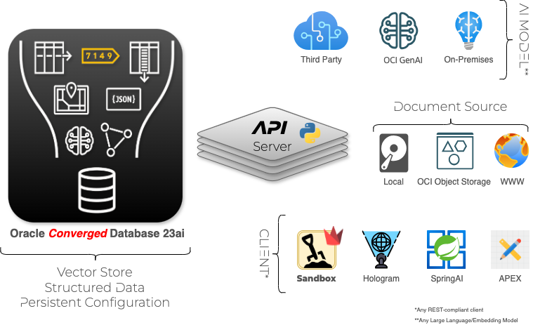
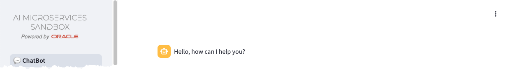

+++
title = 'The Sandbox'
weight = 20
+++

<!--
Copyright (c) 2024, 2025, Oracle and/or its affiliates.
Licensed under the Universal Permissive License v1.0 as shown at http://oss.oracle.com/licenses/upl.

spell-checker:ignore streamlit, oaim, uvicorn
-->

The **Oracle AI Microservices Sandbox** (the **Sandbox**) consists of an API Server ([**oaim-server**](#api-server-oaim-server)) and an _optional_ web-based GUI ([**oaim-sandbox**](#client-oaim-sandbox)) component.  Both the API Server and GUI can be run on bare-metal or inside containers.  

The following additional components, not delivered with the **Sandbox**, are also required.  These can be run On-Premises or in the Cloud:
- [Oracle Database 23ai](#database), including [Oracle Database 23ai **Free**](https://www.oracle.com/uk/database/free/)
- Access to at least one [Large Language Model](#large-language-model)
- Access to at least one [Embedding Model](#embedding-model) (for Retrieval Augmented Generation)

The **Sandbox** is specifically designed to run in container orchestration systems, such as [Kubernetes](https://kubernetes.io/).  For more information on deploying the **Sandbox** in Kubernetes, using a Helm Chart, please review the [Advanced - Microservices](../advanced/microservices) documentation.

## API Server (OAIM Server)

The workhorse of the **Sandbox** is the API Server, referred to as the **OAIM Server**.  By default, the **OAIM Server** will start on port 8000

{}
The **OAIM Server** API documentation can be accessed at `http://<IP Address>:<Port>/v1/docs#` of a running instance. 
{}

Powered by [FastAPI](https://fastapi.tiangolo.com/) and [Uvicorn](https://www.uvicorn.org/), the **OAIM Server** acts as an intermediary between the clients, AI Models, and the Oracle Database.

## Client (OAIM Sandbox)

The provided web-based GUI client is built with [Streamlit](https://streamlit.io/) and interacts with the API Server via REST calls.  

{}
You can develop and replace the provided client with any REST capable client.
{}

## Database

[Oracle Database 23ai](https://www.oracle.com/uk/database/23ai/), including [Oracle Database 23ai **Free**](https://www.oracle.com/uk/database/free/) provides a persistent data store for the **Sandbox**.  

{}
The **Sandbox** can be used to interact with language models without having the database configured, but additional functionality such as RAG, will not be available without the database.
{}

The 23ai database provides:

- the Vector Store for split and embedded documents used for Retrieval Augmented Generation (RAG).
- storage for the [Testbed](testbed) Q&A Test Sets and Evaluations
- storage of **Sandbox** settings and configuration

## Document Source

Access to document sources for the purpose of embedding and populating the Vector Storage is provided. Documents can be accessed from your local storage, OCI Object Storage, or from a web page.

## AI Models

The **Sandbox** provides the ability to connect to any language or embedding model to be used for completions and creating vectors.  Adding, Deleting, and Modifying access to AI Models is quick and easy.