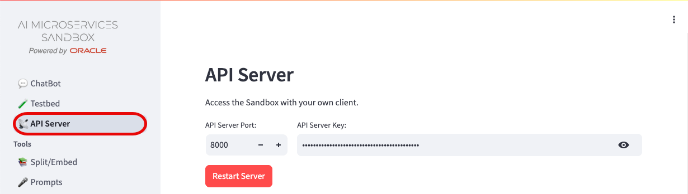
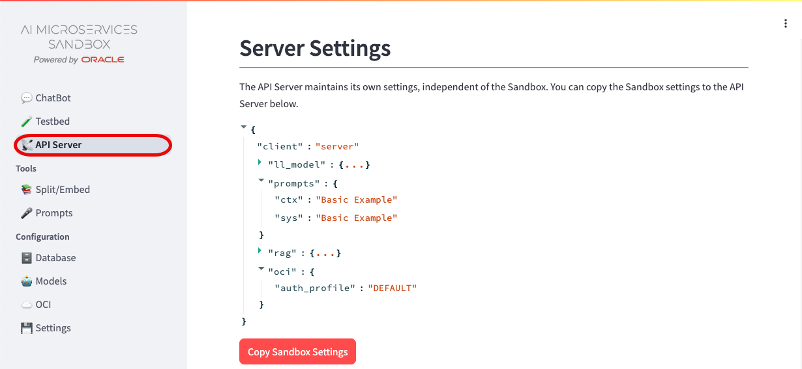
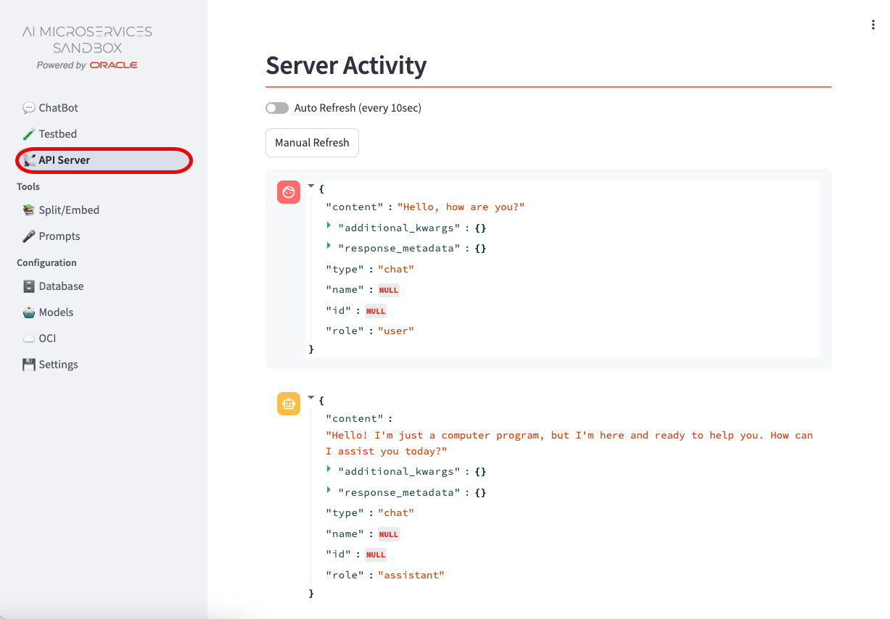

+++
title = '📡 API Server'
weight = 35
+++
<!--
Copyright (c) 2024, 2025, Oracle and/or its affiliates.
Licensed under the Universal Permissive License v1.0 as shown at http://oss.oracle.com/licenses/upl.
-->

The **** (the ****) is powered by an API Server to allow for any client to access its features.  The API Server can be run as part of the provided **** GUI client or as a separate, independent process.  

Each client connected to the API Server, including those from the **** GUI client, share the same configuration but maintain their own settings.  Database, Model, OCI, and Prompt configurations are used across all clients; but which database, models, OCI profile, and prompts set are specific to each client.

When started as part of the **** client, you can change the Port it listens on and the API Server Key.  A restart is required for the changes to take effect.

If the API Server is started independently of the **** client, the configuration is shown, but cannot be modified from the client.

## Server Configuration

During the startup of the API Server, a `server` client is created and populated with minimal settings.  The `server` client is the default when calling the API Server outside of the **** GUI client.  To copy your **** GUI client settings to the `server` client for use with external application clients, click the "Copy AI Explorer Settings".  

You can review how the `server` client is configured by expanding the `{...}` brackets.

## Server Activity

All interactions with the API Server using the `server` client can be seen in the Server Activity.  Toggle the "Auto Refresh" or manually refresh the Activity to see interactions from outside the **** GUI client.

