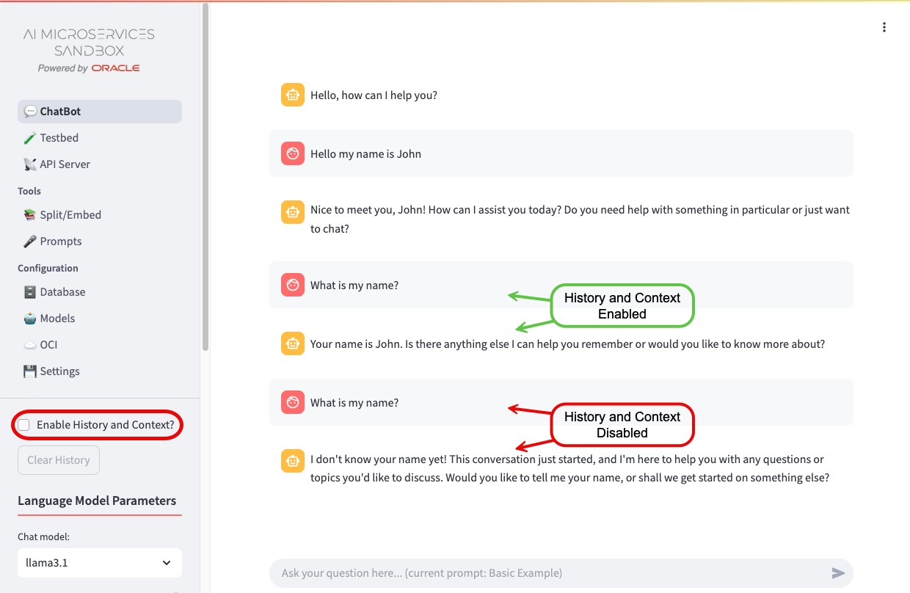

+++
title = '💬 Chatbot'
weight = 20
+++
<!--
Copyright (c) 2024, 2025, Oracle and/or its affiliates.
Licensed under the Universal Permissive License v1.0 as shown at http://oss.oracle.com/licenses/upl.
-->

The {{ .Site.Params.LongName | markdownify }} (the {{ .Site.Params.ShortName | markdownify }}) provides a Chatbot to experiment with different Language settings and Embeddings.  It allows you to manually find the optimal configuration for your AI project before launching it into Production. 

There are a number of configurations you can experiment with to explore AI and RAG capabilities to understand their behavior without requiring deep technical knowledge.

## History and Context

Interactions with the AI models are stored inside a "context window".  When *History and Context* is enabled, the full context window is provided to the model so that it can use previous interactions to guide the next response.  When *History and Context* is disabled, only the last user input is provided.

Use the "Clear History" button to reset the "context window" and start a fresh interaction with a model.

## Language Model Parameters

You can select different, enabled models to experiment with.  To enable, disable, or add models, use the [Configuration - Models](../configuration/model_config) page.  Choose a Language Model based on your requirements, which may include:

**Privacy Concerns** - Local, Open-Source models offer more control over your data.

**Accuracy & Knowledge** - Some models excel in factual correctness, however when using Retrieval Augmented Generation, this is less important when grounding the responses to retrieved sources.

**Speed & Efficiency** - Smaller models run faster and require fewer resources.  When using Retrieval Augmented Generation, smaller models with good Natural Language capabilities is often more important than larger models with lots of knowledge.

**Cost & Accessibility** - Some models are free, cheaper, or available for local use.

Once you've selected a model, you can change the different model parameters to help control the model’s behavior, improving response quality, creativity, and relevance.  Hover over the {} for more information as to what the parameters do.  Here are some general guidelines:

**Response Quality** - Parameters like *Maximum Tokens* and *Frequency penalty* ensure clear, well-structured, and non-repetitive answers.

**Creativity** - *Temperature* and *Top P* influence how unpredictable or original the models output is.  Higher values make responses more varied, lower values make them more focused.

**Relevance** - *Presence penalty* help the model stay on-topic and maintain coherence, especially in longer interactions.

For more details on the parameters, ask the Chatbot or review [Concepts for Generative AI](https://docs.oracle.com/en-us/iaas/Content/generative-ai/concepts.htm).

## Retrieval Augmented Generation (RAG)

Once you've created embeddings using [Split/Embed](../tools/split_embed), the option to enable and disable RAG will be available.  Once you've enabled RAG, if you have more than one [Vector Store](#vector-store) you will need select the one you want to work with.

Choose the type of Search you want performed and the additional parameters associated with that search.

## Vector Store

With RAG enabled, if you have more than one Vector Store, you can select which one will be used for searching, otherwise it will default to the only one available.  To choose a different Vector Store, click the "Reset" button to open up the available options.