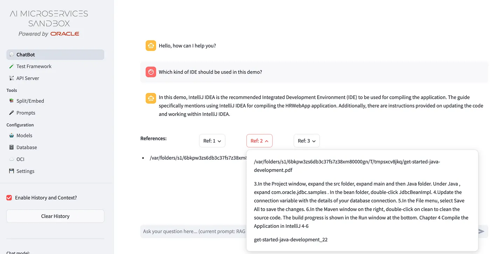
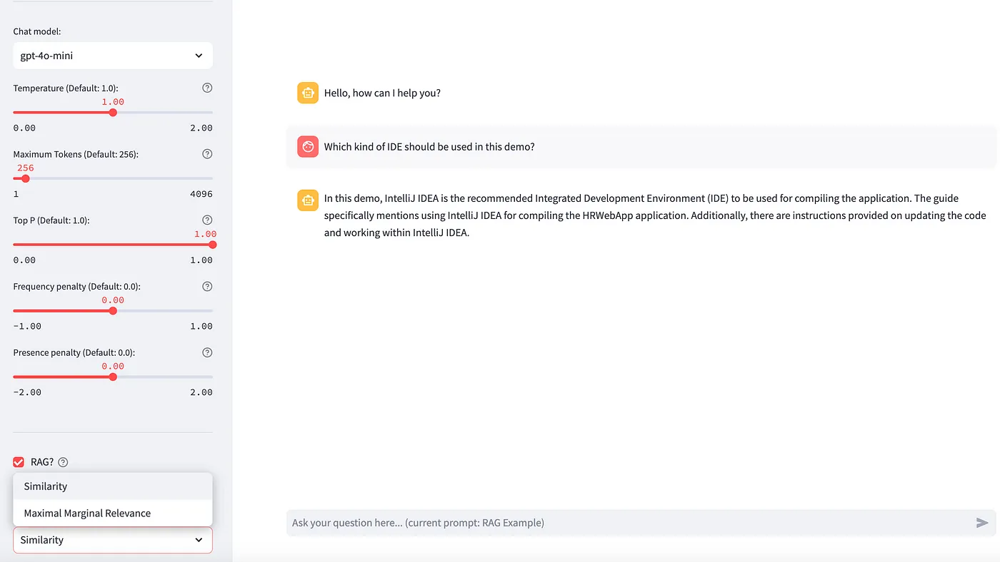

+++
title = '💬 Chatbot'
weight = 20
+++
<!--
Copyright (c) 2023, 2024, Oracle and/or its affiliates.
Licensed under the Universal Permissive License v1.0 as shown at http://oss.oracle.com/licenses/upl.
-->

Differently from a common LLM playgrounds, that help to test an LLM on the information on which has been trained on, the OAIM Sandbox works on the chunks retrieved in the Oracle DB 23ai by similarity with the question provided, like in this example:

The playground could be used with or without the vector stores available, to proof that the pure LLMs configured to be used as completion LLM are aware or not about information you are looking for. Infact:

even the information which a company would provide through the chatbot are public, it is not said that the public LLM services have been yet trained on these information and a RAG approach is still needed.

Clicking on the RAG check box you can quickly turn on/off the knowledge base behind the chatbot:

As you can see, all the most important parameters related to the LLM chosen could be modified to test the agent behaviour. The Similarity search reflects the two options available on the **Oracle DB 23ai**: **Similarity search** and **Maximal Marginal Relevance**.

