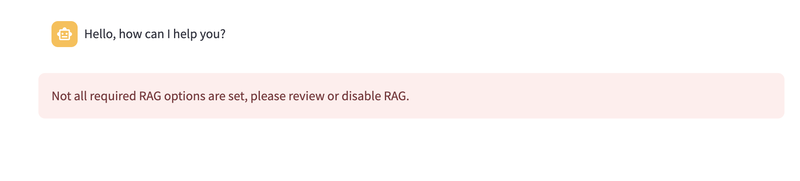

+++
title = '💬 Chatbot'
weight = 20
+++
<!--
Copyright (c) 2024-2025, Oracle and/or its affiliates.
Licensed under the Universal Permissive License v1.0 as shown at http://oss.oracle.com/licenses/upl.
-->

The **Oracle AI Microservices Sandbox** (the **Sandbox**) provides a 

Differently from a common LLM playground, that helps to test an LLM on the information on which has been trained on, the OAIM Sandbox works on the chunks retrieved in the Oracle DB 23ai by similarity with the question provided, like in this example:

The playground could be used with or without the vector stores available, to check if a pure LLM configured is aware or not about information you are looking for.

You can, first of all:

- **Enable History and Context**: in this way any further question & answer provided will be re-sent in the context to help the LLM to answer with a better grounded info, if it's checked;
- **Clear History**: this button clear the context to better understand the LLM behaviour after a long conversation;

## Chat Model
Depending on the configuration done in the **Configuration**/**Models** page, you can choose one of the **Chat model** enlisted. For each of them you can modify the most important hyper-parameters like:
- Temperature
- Maximum Tokens
- Top P
- Frequency penalty
- Presence penalty

To understand each of them, refers for example on this document: [Concepts for Generative AI](https://docs.oracle.com/en-us/iaas/Content/generative-ai/concepts.htm).

## RAG params

Clicking on the **RAG** checkbox you can quickly turn on/off the knowledge base behind the chatbot, exploiting the Retrieval Augentened Generation pattern implemented into the Oracle AI Microserves Sandbox.

Then you can set:

- **Enable Re-Ranking**: *under development*;
- **Search Type**: it reflects the two options available on the **Oracle DB 23ai**: 
    - **Similarity search**
    - **Maximal Marginal Relevance**.
- **Top K**: define the number of nearest chunks, found comparing the embedding vector derived by the question with the vectors associated in the vectorstore with each chunk. Take in consideration that a large number of chunk could fill the maximum context size accepted by the LLM becoming useless the text that exceeds that limit.

To search and select one of the vectorstore tables created into the DB and use it for the RAG, you could use one, or the combination of more than one parameter adopted in the chunking process, to filter the desired vectorstore: 

- **Embedding Alias**
- **Embedding Model**
- **Chunk Size**
- **Chunk Overlap**
- **Distance Strategy**

Until the following message will not disappear, it means that the final vectorstore is not yet selected:

The **Reset RAG** button allows you to restart the selection of another vectorestore table.
