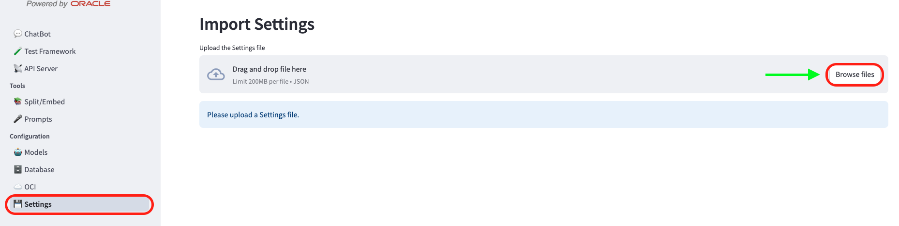
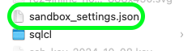
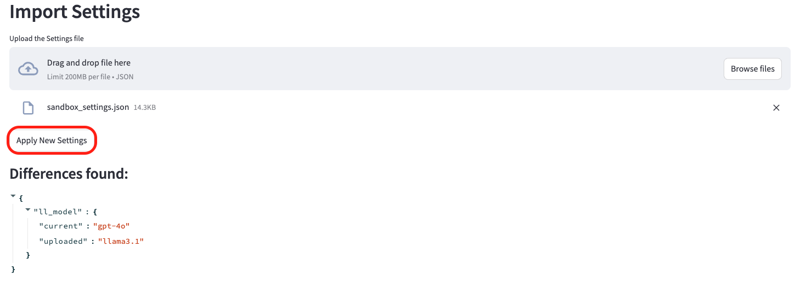
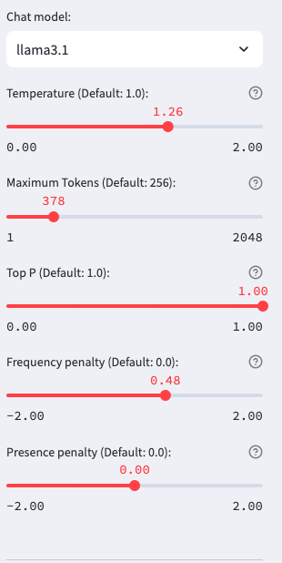

+++
title = '💾 Import Settings'
weight = 40
+++

<!--
Copyright (c) 2023, 2024, Oracle and/or its affiliates.
Licensed under the Universal Permissive License v1.0 as shown at http://oss.oracle.com/licenses/upl.
-->
## Import Settings

Once you are satisfied with a specific configuration for your chatbot, the Explorer allows you to `Download Settings` as they are in a **.json** format. 

### Configuration -> Import Settings

To import the settings that were downloaded previously, you can navigate to `Configuration -> Settings`:

After clicking on `Browse files`, you will have to select your Explorer settings **.json** file:

The Explorer will detect the saved configuration and ask you to apply the new settings:

Once you upload the saved settings, the Explorer will automatically update the chatbot parameters to match the ones you saved previously and that's it!

