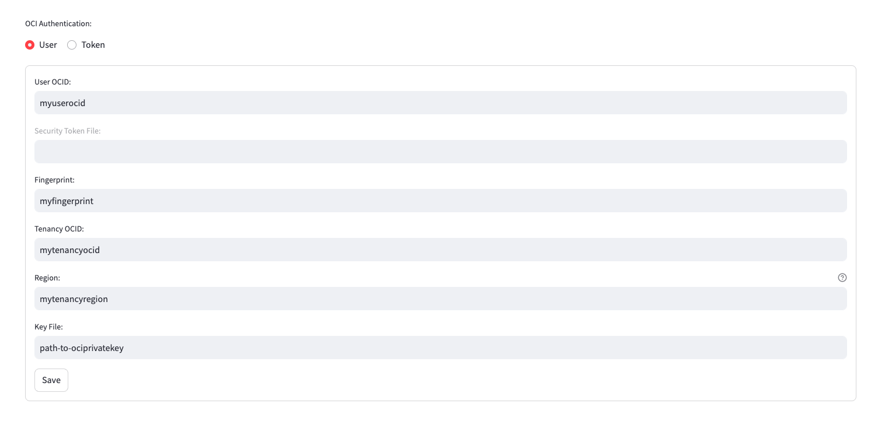

+++
title = '☁️ OCI Configuration'
weight = 30
+++

<!--
Copyright (c) 2023, 2024, Oracle and/or its affiliates.
Licensed under the Universal Permissive License v1.0 as shown at http://oss.oracle.com/licenses/upl.
-->

When using the split/embed functionality of the Sandbox, you can use the OCI Object storage. In this page we provide how to configure the OAIM Sandbox to use it.

## Configuration

The OCI credentials can either be configured using an /.oci/config file or through the **Sandbox** interface.

### Sandbox Interface

To configure the OCI credentials from the Sandbox, navigate to `Configuration -> OCI`:

Provide the following input:

- **User OCID**: Your personal User OCID [User OCID](#OCI-credentials) that can be retrieved on your OCI tenancy interface
- **Fingerprint**: The **Fingerprint** associated to your OCI private API key
- **Tenancy OCID**: The OCID associated to the tenancy you want to connect to, that can be retrieved on your OCI interface
- **Region**: The tenancy region you want to connect to
- **Key File**: The file path to your OCI private API key

Once all fields are set, click the `Save` button.

### /.oci/config file

If you have the related /.oci/config file configured, the Sandbox will read from the **DEFAULT** profile at startup and load the credentials as follows:

- **User OCID**: Your personal User OCID [User OCID](#OCI-credentials) that can be retrieved on your OCI tenancy interface
- **Fingerprint**: The **Fingerprint** associated to your OCI private API key
- **Tenancy OCID**: The OCID associated to the tenancy you want to connect to, that can be retrieved on your OCI interface
- **Region**: The tenancy region you want to connect to
- **Key File**: The file path to your OCI private API key

Once all fields are set, click the `Save` button.

### OCI credentials

Here's a summary of all the OCI credentials and where to find them:

| Entry                | Description and Where to Get the Value   | Required? |
| -------------------- | ---------------------------------------- | ----------|
| user                 | OCID of the user calling the API. To get the value, see [Required Keys and OCIDs](https://docs.oracle.com/en-us/iaas/Content/API/Concepts/apisigningkey.htm#Required_Keys_and_OCIDs)     Example: ocid1.user.oc1..<unique_ID>(shortened for brevity)   | Yes |
| fingerprint          | Fingerprint for the public key that was added to this user. To get the value, see [Required Keys and OCIDs](https://docs.oracle.com/en-us/iaas/Content/API/Concepts/apisigningkey.htm#Required_Keys_and_OCIDs)                                                  | Yes |
| key_file             | Full path and filename of the private key.    **Important:** The key pair must be in PEM format. For instructions on generating a key pair in PEM format, see [Required Keys and OCIDs](https://docs.oracle.com/en-us/iaas/Content/API/Concepts/apisigningkey.htm#Required_Keys_and_OCIDs).   Example (Linux/Mac OS): ~/.oci/oci_api_key.pem.    Example (Windows): ~/.oci/oci_api_key.pem.    This corresponds to the file %HOMEDRIVE%%HOMEPATH%\.oci\oci_api_key.pem. | Yes |
| tenancy              | OCID of your tenancy. To get the value, see [Required Keys and OCIDs](https://docs.oracle.com/en-us/iaas/Content/API/Concepts/apisigningkey.htm#Required_Keys_and_OCIDs)    Example: ocid1.tenancy.oc1..<unique_ID> | Yes |
| region               | An Oracle Cloud Infrastructure region. See [Regions and Availability Domains](https://docs.oracle.com/en-us/iaas/Content/General/Concepts/regions.htm)    Example: us-ashburn-1                                         | Yes |
| security_token_file  | If session token authentication is being used, then this parameter is required.    Using this authentication method makes fingerprint, user, and pass_phrase not required. Starting a session with the OCI CLI will populate all of the required parameters for this authentication method.                                       | Conditional |