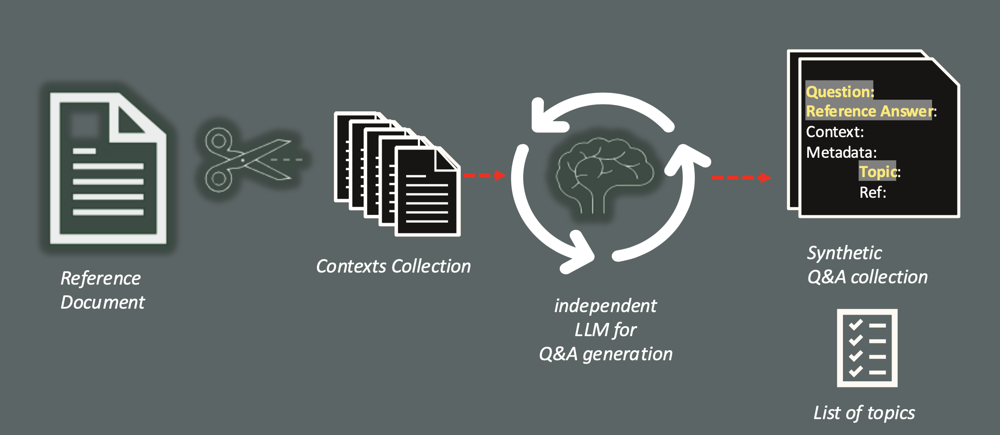
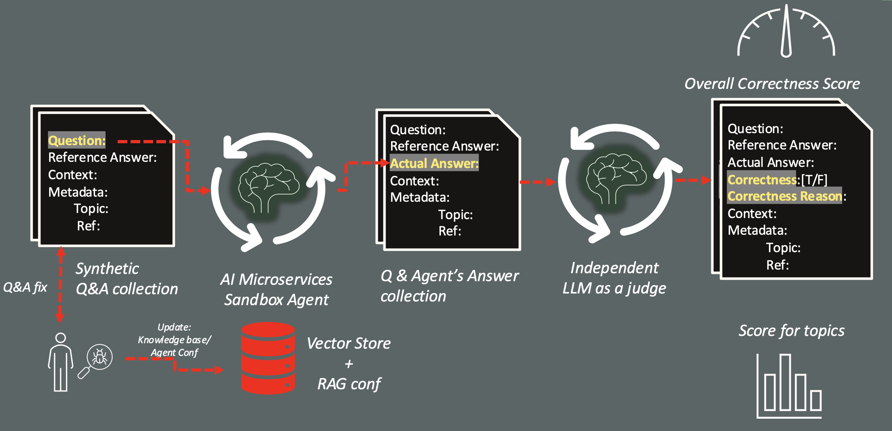
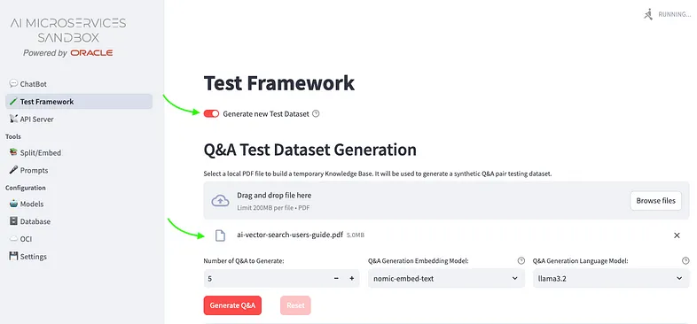
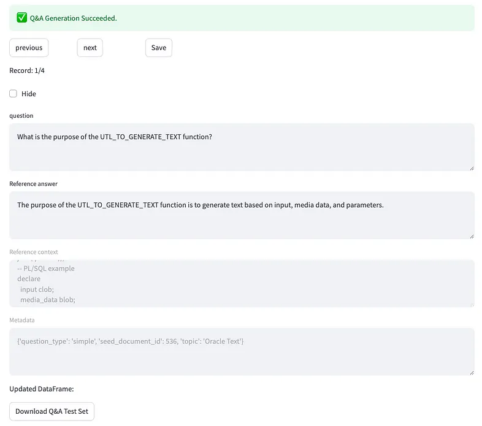
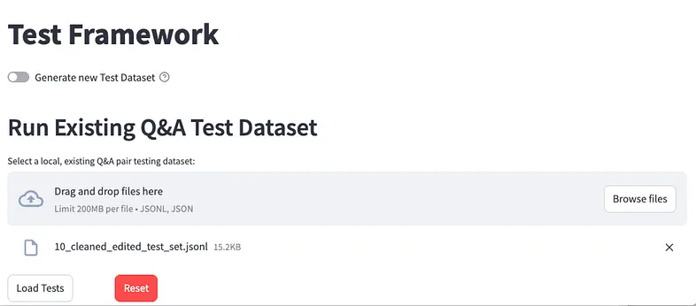
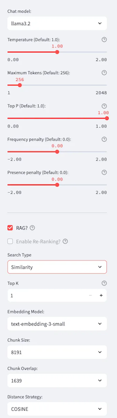

+++
title = '🧪 Test Framework'
weight = 30
+++
<!--
Copyright (c) 2023, 2024, Oracle and/or its affiliates.
Licensed under the Universal Permissive License v1.0 as shown at http://oss.oracle.com/licenses/upl.
-->
Generating a test dataset Q&A pairs through an external LLM accelerates the massive test phase. The platform provides the integration with a framework designed for this scope, called Giskard, that analyze the document to identify also the high level topics related to the Q&A pairs generated, and include them into the test dataset.

The generation phase is optional, but normally very welcome to reduce the cost of the Proof-of-concepts, since requires a huge human effort.

Then, the questions are asked to the agent configured, collecting each answer provided and compared with the correct answer through an LLM, elected as judge, that classifies them and provides a justification for the positive or negative response, in a process described in the following picture.

## Test Framework page
From the left side menu, you will access to the page on which, selecting the **Generate new Test Dataset**, you can upload as many pdf documents you want by which will be extracted contexts to be used to generate a defined number of Q&A, as shown in the following snapshot:

You can choose any of the models available to perform a Q&A generation process, since you could be interested to use an high profile, expensive model for the crucial dataset generation to evaluate the RAG app, eventually with a cheaper llm model to put in production as chat model. This phase not only generate the number of Q&A you need, but it will analyze the document provided extracting a set of topics that could help to classify the questions generated and can help to find the area to be improved.

When the generation is over (it could takes time), as shown in the following snapshot:

you can:

* exclude a Q&A: clicking **Hide** you’ll drop the question from the final dataset if you consider it not meaningful;
* modify the text of the **question** and the **Reference answer**: if you are not agree, you can updated the raw text generated, according the **Reference context** that is it fixed, like the **Metadata**.
After your updates, you can download the dataset to store it for next test sessions.

Anyway, the generation process it’s optional. If you already have prepared a JSONL file with your Q&A, according this schema:

* **id**: an alphanumeric unique id like ”2f6d5ec5–4111–4ba3–9569–86a7bec8f971";
* **question**
* **reference_answer**: an example of answer considered right;
* **reference_context**: a piece of document by which has been extracted the question;
* **conversation_history**: it’s an array empty [], at the moment not evaluated;
* **metadata**: a include nested json doc with extra info to be used for analytics aim, and must include the following fields: 
    - **question_type** **[simple|complex]**;
    - **seed_document_id** (numeric);
    - **topic**.

you can simply upload it as shown here:

If you need an example, let’s generate just one Q&A and download it, and add to your own Q&As Test Dataset.

At this point, if you have generated or you will use an existing test dataset, you can run the overall test on a configuration currently selected on the left side:

The top part is related to the LLM are you going to be used for chat generation, and it includes the most relevant hyper-parameters to use in the call. The lower part it’s related to the Vector Store used in which, apart the **Embedding Model**, **Chunk Size**, **Chunk Overlap** and **Distance Strategy**, that are fixed and coming from the **Split/Embed** process you have to perform before, you can modify:

* **Top K**: how many chunks should be included in the prompt’s context from nearer to the question found;
* **Search Type**: that could be Similarity or Maximal Marginal Relevance. The first one is it commonly used, but the second one it’s related to an Oracle DB23ai feature that allows to exclude similar chunks from the top K and give space in the list to different chunks providing more relevant information.

At the end of the evaluation it will be provided an **Overall Correctness Score**, that’s is simply the percentage of correct answers on the total number of questions submitted:

Moreover, a percentage by topics, the list of failures and the full list of Q&As will be evaluated. To each Q&A included into the test dataset, will be added:

* **agent_answer**: the actual answer provided by the RAG app;
* **correctness**: a flag true/false that evaluates if the agent_answer matches the reference_answer;
* **correctness_reason**: the reason why an answer has been evaluated wrong by the judge LLM.

The list of **Failures**, **Correctness by each Q&A**, as well as a **Report**, could be download and stored for future audit activities.

*In this way you can perform several tests using the same curated test dataset, generated or self-made, looking for the best performance RAG configuration*.
