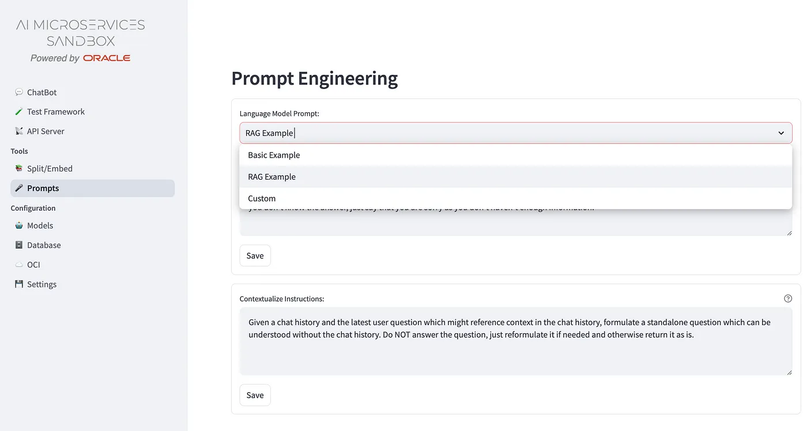

+++
title = '🎤 Prompts'
weight = 10
+++

<!--
Copyright (c) 2023, 2024, Oracle and/or its affiliates.
Licensed under the Universal Permissive License v1.0 as shown at http://oss.oracle.com/licenses/upl.
-->

An important key factor that influences the quality of answers it depends from the prompt provided to the LLM, that includes the context information. To customize and test the effect, it’s available the **Prompts** voice of menu that offers pre-configured list of prompt templates that could be customized and associated to the RAG system.

There are three options available:
- **Basic Example** : it is automatically paired with the no-rag, pure LLM chatbot configuration; 
- **RAG Example** : it is automatically paired if the RAG checkbox set to True;
- **Custom** : it's applied to any RAG/no-RAG configuration.
