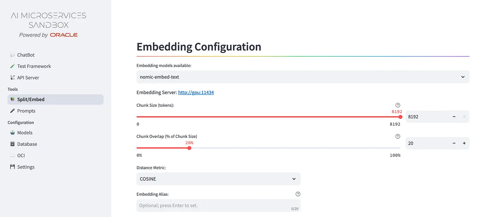
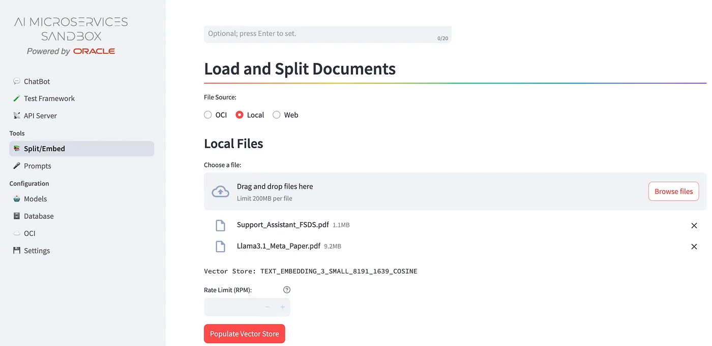

+++
title = '📚 Split/Embed'
weight = 20
+++

<!--
Copyright (c) 2023, 2024, Oracle and/or its affiliates.
Licensed under the Universal Permissive License v1.0 as shown at http://oss.oracle.com/licenses/upl.
-->

The first phase building a RAG Chatbot starts with the document chunking based on vector embeddings generation, that will be stored into a vector store to be retrieved by vectors distance search and added to the context in order to answer the question grounded to the information provided.

We choose the freedom to exploit LLMs for vector embeddings provided by public services like Cohere, OpenAI, and Perplexity, or running on top a GPU compute node managed by the user and exposed through open source platforms like OLLAMA or HuggingFace, to avoid sharing data with external services that are beyond full customer control.

From the **Split/Embed** voice of the left side menu, you’ll access to the ingestion page:

The Load and Split Documents, parts of Split/Embed form, will allow to choose documents (txt,pdf,html,etc.) stored on the Object Storage service available on the Oracle Cloud Infrastructure, on the client’s desktop or getting from URLs, like shown in following snapshot:

It will be created a “speaking” table, like the TEXT_EMBEDDING_3_SMALL_8191_1639_COSINE in the example. You can create, on the same set of documents, several options of vectorstore table, since nobody normally knows which is the best chunking size, and then test them indipendently.

## Embedding Configuration

Choose one of the **Embedding models available** from the listbox that will depend by the **Configuration/Models** page.
The **Embedding Server** URL associated to the model chosen will be shown. The **Chunk Size (tokens)** will change according the kind of embeddings model selected, as well as the **Chunk Overlap (% of Chunk Size)**. 
Then you have to choose one of the **Distance Metric** available in the Oracle DB23ai:
- COSINE
- EUCLIDEAN_DISTANCE
- DOT_PRODUCT
- MAX_INNER_PRODUCT
To understand the meaning of these metrics, please refer to the doc [Vector Distance Metrics](https://docs.oracle.com/en/database/oracle/oracle-database/23/vecse/vector-distance-metrics.html) in the Oracle DB23ai "*AI Vector Search User's Guide*".

The **Embedding Alias** field let you to add a more meaningful info to the vectorstore table that allows you to have more than one vector table with the same: *model + chunksize + chunk_overlap + distance_strategy* combination.

## Load and Split Documents

The process that starts clicking the **Populate Vector Store** button needs:
- **File Source**: you can include txt,pdf,html documents from one of these sources:
    - **OCI**: you can browse and add more than one document into the same vectostore table at a time;
    - **Local**: uploading more than one document into the same vectostore table at a time;
    - **Web**: upload one txt,pdf,html from the URL provided.

- **Rate Limit (RPM)**: to avoid that a public LLM embedding service bans you for too much requests per second, out of your subscription limits.

The **Vector Store** will show the name of the table will be populated into the DB, according the naming convention that reflects the parameters used.

