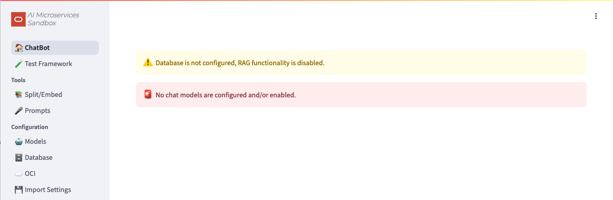
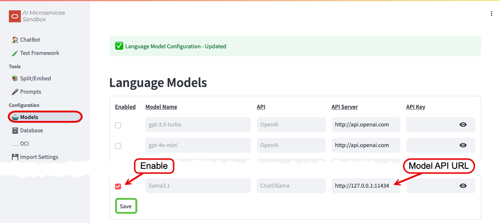
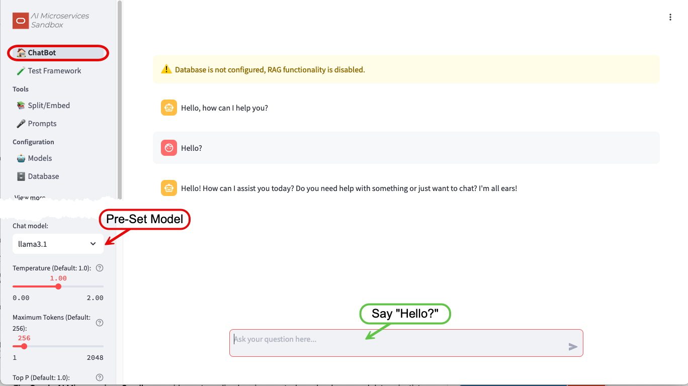
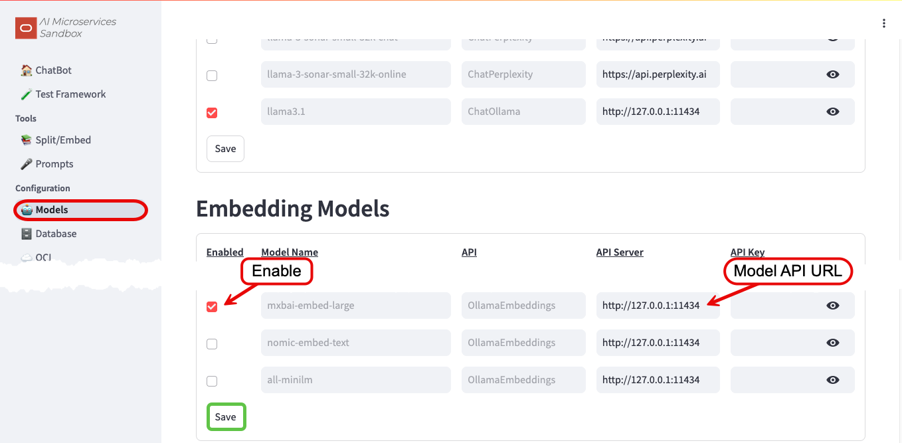
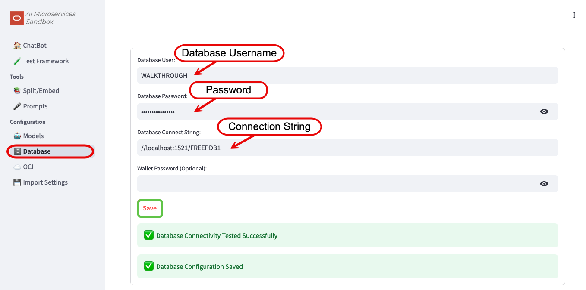
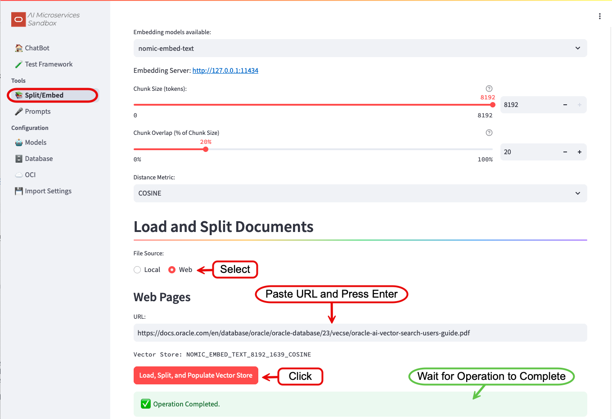
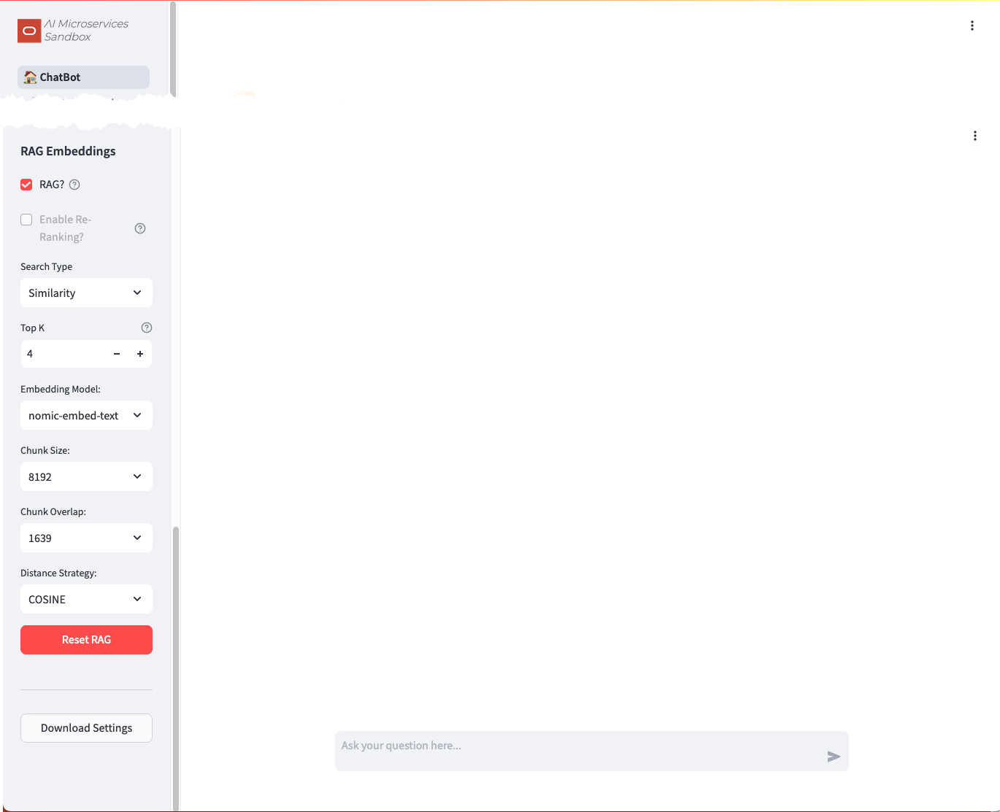

+++
title = 'Walkthrough'
date = 2024-09-11T14:33:30Z
draft = false
+++

This walkthrough will guide you through a basic installation of the **Oracle AI Microservices Sandbox** (the **Sandbox**). It will allow you to experiment with GenAI, using Retrieval-Augmented Generation (**RAG**), with the Oracle Database 23ai at its core.

By the end of the walkthrough you should be familiar with:

- Configuring the Vector Storage
- Configuring a Large Language Model (**LLM**)
- Configuring an Embedding Model
- Splitting, Embedding, and Storing vectors for **RAG**
- Experimenting with the **Sandbox**

What you'll need for the walkthrough:

- Access to an environment where you can run container images (Podman or Docker).
- Internet Access (docker.io and container-registry.oracle.com)


The performance of the **Sandbox** will vary depending on the infrastructure. LLMs and Embedding Models are designed to use GPUs, but this walkthrough will work on machines with just CPUs; albeit much slower!




## Installation

**NOTE:** The walkthrough will reference `podman` commands. If applicable to your environment, `podman` can be substituted with `docker`.

You will run four container images to establish the infrastructure:

- Vector Storage - Oracle Database 23ai Free
- On-Premises **LLM** - llama3.1
- On-Premises Embedding Model - mxbai-embed-large
- The **Sandbox**

### Vector Storage - Oracle Database 23ai Free

AI Vector Search in Oracle Database 23ai provides the ability to store and query private business data using a natural language interface.  
The **Sandbox** uses these capabilities to provide more accurate and relevant LLM responses via Retrieval-Augmented Generation (RAG).

[Oracle Database 23ai Free](https://www.oracle.com/uk/database/free/get-started/) provides an ideal, no-cost vector store for this walkthrough.

To start Oracle Database 23ai Free:

1. Start the container:

   ```bash
   podman run -d --name OAIM -p 1521:1521 container-registry.oracle.com/database/free:latest
   ```

1. Create a [new database user](../configuration/db_config.md#database-user):

   ```bash
   podman exec -it OAIM sqlplus '/ as sysdba'
   ```

   ```sql
   alter session set container=FREEPDB1;

   CREATE USER "WALKTHROUGH" IDENTIFIED BY ORA_41_M_SANDBOX
       DEFAULT TABLESPACE "USERS"
       TEMPORARY TABLESPACE "TEMP";
   GRANT "DB_DEVELOPER_ROLE" TO "WALKTHROUGH";
   ALTER USER "WALKTHROUGH" DEFAULT ROLE ALL;
   ALTER USER "WALKTHROUGH" QUOTA UNLIMITED ON USERS;
   EXIT;
   ```

### LLM - llama3.1

Use [Ollama](https://ollama.com/) to run the _llama3.1_ **LLM**.

1. Start the container:

   ```bash
   podman run -d -v ollama:$HOME/.ollama -p 11434:11434 --name ollama docker.io/ollama/ollama
   ```

1. Pull the **LLM** into the container:

   ```bash
   podman exec -it ollama ollama pull llama3.1
   ```

1. Test the **LLM**:

   ```bash
   curl http://127.0.0.1:11434/api/generate -d '{
   "model": "llama3.1",
   "prompt": "Why is the sky blue?",
   "stream": false
   }'
   ```

### Embedding - mxbai-embed-large

Use the existing [Ollama](https://ollama.com/) container for the embedding model.

1. Pull the embedding model into the container:

   ```bash
   podman exec -it ollama ollama pull mxbai-embed-large
   ```

### Oracle AI Microservices Sandbox

1. Download and Unzip the latest version of the **Sandbox**:

   ```bash
   wget -O oaim-sandbox.tar.gz https://github.com/oracle-samples/oaim-sandbox/archive/refs/heads/main.tar.gz
   mkdir oaim-sandbox
   tar zxf oaim-sandbox.tar.gz --strip-components=1 -C oaim-sandbox
   ```

1. Build the Container Image

   ```bash
   cd oaim-sandbox/app
   podman build -t localhost/oaim-sandbox:latest .

   ```

1. Start the **Sandbox**:

   ```bash
   podman run -d --name oaim-sandbox --net="host" localhost/oaim-sandbox:latest
   ```

If you are running the **Sandbox** on a remote host, you may need to allow access to the `8501` port.

For example, in Oracle Linux 9 with `firewalld`:

```bash
firewall-cmd --zone=public --add-port=8501/tcp --permanent
```

## Configuration

With the "infrastructure" in-place, you're ready to configure the **Sandbox**. In a web browser, navigate to your hosts `8501` port:



Notice that neither the database nor models are configured for use. Let's start the configuration.

### Configure the LLM

To configure the On-Premises **LLM**, navigate to the _Configuration -> Model_ screen:

1. Enable the `llama3.1` model by ticking the checkbox
1. Configure the _API URL_ to `http://127.0.0.1:11434`
1. Save



#### Say Hello?

Navigate to the _Chatbot_ screen:



The `Chat Model` will have been pre-set to the only enabled **LLM** (`llama3.1`) and a dialog box to interact with the **LLM** will be ready for input.

Feel free to play around with the different **LLM** Parameters, hovering over the "?" icons to get more information on what they do.
You'll come back to the _Chatbot_ later to experiment further.

### Configure the Embedding Model

To configure the On-Premises Embedding Model, navigate back to the _Configuration -> Model_ screen:

1. Enable the `mxbai-embed-large` model by ticking the checkbox
1. Configure the _API URL_ to `http://127.0.0.1:11434`
1. Save



### Configure the Database

To configure Oracle Database 23ai Free, navigate to the _Configuration -> Database_ screen:

1. Enter the Database Username: `WALKTHROUGH`
1. Enter the Database Password for `WALKTHROUGH`: `ORA_41_M_SANDBOX`
1. Enter the Database Connection String: `//localhost:1521/FREEPDB1`
1. Save



## Split and Embed

With the embedding model and database configured, you can now split and embed documents for use in **RAG**.


Depending on the infrastructure, the embedding process can take a few minutes.


Navigate to the _Split/Embed_ Screen:

1. Change the File Source to `Web`
1. Enter the URL: `https://docs.oracle.com/en/database/oracle/oracle-database/23/vecse/oracle-ai-vector-search-users-guide.pdf`
1. Press Enter
1. Click _Load, Split, and Populate Vector Store_
1. Please be patient...



### Query the Vector Store

After the splitting and embedding process completes, you can query the Vector Store to see the chunked and embedded document:

From the command line:

1. Connect to the Oracle Database 23ai Database:

   ```bash
   podman exec -it OAIM sqlplus '/ as sysdba'
   ```

1. Set the container and query the Vector Store:

   ```sql
   alter session set container=FREEPDB1;
   select * from WALKTHROUGH.MXBAI_EMBED_LARGE_512_103_COSINE
   ```

## Experiment

With the **Oracle AI Microservices Sandbox** configured, you're ready for some experimentation.

Navigate back to the _Chatbot_. There should be no more configuration warnings and `RAG?` should be automatically enabled:



For this guided experiment, perform the following:

1. Disable **RAG** by un-checking the _RAG?_ box
1. Ask the Chatbot:
   ```text
   In Oracle Database 23ai, how do I determine the accuracy of your vector indexes?
   ```

Responses may vary, but generally the Chatbot's response will be inaccurate, including:

- Not understanding that 23ai is an Oracle Database release. This is known as knowledge-cutoff.
- Suggestions of running SELECTS, DBMS stored procedures and maybe an ANALYZE. These are hallucinations.

Now enable _RAG?_ and simply ask: `Are you sure?`


With **RAG** enabled, all the services (**LLM**/Embedding Models and Database) are being utilized. Depending on your hardware, this may cause the response to be significantly delayed.


By asking `Are you sure?`, you are taking advantage of the **Sandbox**'s history and context functionality.  
The response should be significantly different and include references to `DBMS_VECTOR` and links to the documentation where this information can be found. It might even include an apology!

## What's Next?

You should now have a solid foundation in utilizing the **Oracle AI Microservices Sandbox**.
To take your experiments to the next level, consider exploring these additional dimensions:

- Turn On/Off/Clear history
- Experiment with different Large Language Models (LLMs) and Embedding Models
- Tweak LLM parameters, including Temperature and Penalties, to fine-tune model performance
- Investigate various strategies for splitting and embedding text data, such as adjusting chunk-sizes, overlaps, and distance metrics
