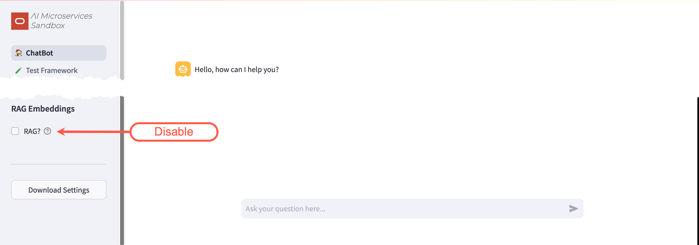
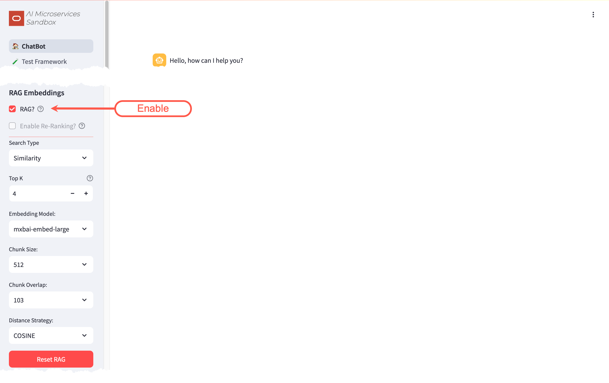

+++
title = 'Walkthrough'
date = 2024-09-11T14:33:30Z
draft = false
+++

<!--
Copyright (c) 2023, 2024, Oracle and/or its affiliates.
Licensed under the Universal Permissive License v1.0 as shown at http://oss.oracle.com/licenses/upl.
-->

This walkthrough will guide you through a basic installation of the **Oracle AI Microservices Sandbox** (the **Sandbox**). It will allow you to experiment with GenAI, using Retrieval-Augmented Generation (**RAG**) with Oracle Database 23ai at the core.

By the end of the walkthrough you will be familiar with:

- Configuring a Large Language Model (**LLM**)
- Configuring an Embedding Model
- Configuring the Vector Storage
- Splitting, Embedding, and Storing vectors for **RAG**
- Experimenting with the **Sandbox**

What you'll need for the walkthrough:

- Internet Access (docker.io and container-registry.oracle.com)
- Access to an environment where you can run container images (Podman or Docker).
- 100G of free disk space.
- Sufficient GPU/CPU resources to run the **LLM**, embedding model, and database (see below).


The performance of the **Sandbox** will vary depending on the infrastructure.

**LLM**s and Embedding Models are designed to use GPUs, but this walkthrough _can work_ on machines with just CPUs; albeit _much_ slower!
When testing the **LLM**, if you don't get a response in a couple of minutes; your hardware is not sufficient to continue with the walkthrough.




## Installation


The walkthrough will reference `podman` commands. If applicable to your environment, `podman` can be substituted with `docker`.
If you are using `docker`, make the walkthrough easier by aliasing the `podman` command:

`alias podman=docker`.


You will run four container images to establish the "Infrastructure":

- On-Premises **LLM** - llama3.1
- On-Premises Embedding Model - mxbai-embed-large
- Vector Storage - Oracle Database 23ai Free
- The **Sandbox**

### LLM - llama3.1

To enable the _ChatBot_ functionality, access to a **LLM** is required. The walkthrough will use [Ollama](https://ollama.com/) to run the _llama3.1_ **LLM**.

1. Start the container :

   ```bash
   podman run -d --gpus=all -v ollama:$HOME/.ollama -p 11434:11434 --name ollama docker.io/ollama/ollama
   ```

1. Pull the **LLM** into the container:

   ```bash
   podman exec -it ollama ollama pull llama3.1
   ```

1. Test the **LLM**:

   
   Unfortunately, if the below `curl` does not respond within five minutes, the rest of the walkthrough will be unbearable.
   If this is the case, please consider using different hardware.
   

   ```bash
   curl http://127.0.0.1:11434/api/generate -d '{
   "model": "llama3.1",
   "prompt": "Why is the sky blue?",
   "stream": false
   }'
   ```

### Embedding - mxbai-embed-large

To enable the **RAG** functionality, access to an embedding model is required. The walkthrough will use [Ollama](https://ollama.com/) to run the _mxbai-embed-large_ embedding model.

1. Pull the embedding model into the container:

   ```bash
   podman exec -it ollama ollama pull mxbai-embed-large
   ```

### Vector Storage - Oracle Database 23ai Free

AI Vector Search in Oracle Database 23ai provides the ability to store and query private business data using a natural language interface. The **Sandbox** uses these capabilities to provide more accurate and relevant **LLM** responses via Retrieval-Augmented Generation (**RAG**). [Oracle Database 23ai Free](https://www.oracle.com/uk/database/free/get-started/) provides an ideal, no-cost vector store for this walkthrough.

To start Oracle Database 23ai Free:

1. Start the container:

   ```bash
   podman run -d --name oaim-db -p 1521:1521 container-registry.oracle.com/database/free:latest
   ```

1. Alter the `vector_memory_size` parameter and create a [new database user](../configuration/db_config#database-user):

   ```bash
   podman exec -it oaim-db sqlplus '/ as sysdba'
   ```

   ```sql
   alter system set vector_memory_size=512M scope=spfile;

   alter session set container=FREEPDB1;

   CREATE USER "WALKTHROUGH" IDENTIFIED BY ORA_41_M_SANDBOX
       DEFAULT TABLESPACE "USERS"
       TEMPORARY TABLESPACE "TEMP";
   GRANT "DB_DEVELOPER_ROLE" TO "WALKTHROUGH";
   ALTER USER "WALKTHROUGH" DEFAULT ROLE ALL;
   ALTER USER "WALKTHROUGH" QUOTA UNLIMITED ON USERS;
   EXIT;
   ```

1. Bounce the database for the `vector_memory_size` to take effect:

   ```bash
   podman container restart oaim-db
   ```

### Oracle AI Microservices Sandbox

The **Sandbox** provides an easy to use front-end for experimenting with **LLM** parameters and **RAG**.

1. Download and Unzip the latest version of the **Sandbox**:

   ```bash
   wget -O oaim-sandbox.tar.gz https://github.com/oracle-samples/oaim-sandbox/archive/refs/heads/main.tar.gz
   mkdir oaim-sandbox
   tar zxf oaim-sandbox.tar.gz --strip-components=1 -C oaim-sandbox
   ```

1. Build the Container Image

   ```bash
   cd oaim-sandbox/app
   podman build -t localhost/oaim-sandbox:latest .

   ```

1. Start the **Sandbox**:

   ```bash
   podman run -d --name oaim-sandbox --net="host" localhost/oaim-sandbox:latest
   ```

If you are running the **Sandbox** on a remote host, you may need to allow access to the `8501` port.

For example, in Oracle Linux 8/9 with `firewalld`:

```bash
firewall-cmd --zone=public --add-port=8501/tcp --permanent
```

## Configuration

With the "Infrastructure" in-place, you're ready to configure the **Sandbox**. In a web browser, navigate to your host's `8501` port:


Notice that neither the database nor models are configured for use. Let's start the configuration.

### Configure the LLM

To configure the On-Premises **LLM**, navigate to the _Configuration -> Models_ screen:

1. Enable the `llama3.1` model that you pulled earlier by ticking the checkbox
1. Configure the _API URL_ to `http://127.0.0.1:11434`
1. Save


 More information about configuring **LLM**s in the **Sandbox** can be found in the [Model Configuration](../configuration/model_config) documentation.

#### Say "Hello?"

Navigate to the _ChatBot_ screen:


The error about chat models will have disappeared, but the database warning will still be displayed. You'll take care of that in the next step.

The `Chat model:` will have been pre-set to the only enabled **LLM** (_llama3.1_) and a dialog box to interact with the **LLM** will be ready for input.

Feel free to play around with the different **LLM** Parameters, hovering over the 
icons to get more information on what they do.

You'll come back to the _ChatBot_ later to experiment further.

### Configure the Embedding Model

To configure the On-Premises Embedding Model, navigate back to the _Configuration -> Models_ screen:

1. Enable the `mxbai-embed-large` model that you pulled earlier by ticking the checkbox
1. Configure the _API URL_ to `http://127.0.0.1:11434`
1. Save


 More information about configuring embedding models in the **Sandbox** can be found in the [Model Configuration](../configuration/model_config) documentation.

### Configure the Database

To configure Oracle Database 23ai Free, navigate to the _Configuration -> Database_ screen:

1. Enter the Database Username: `WALKTHROUGH`
1. Enter the Database Password for `WALKTHROUGH`: `ORA_41_M_SANDBOX`
1. Enter the Database Connection String: `//localhost:1521/FREEPDB1`
1. Save


 More information about configuring the database in the **Sandbox** can be found in the [Database Configuration](../configuration/db_config) documentation.

## Split and Embed

With the embedding model and database configured, you can now split and embed documents for use in **RAG**.

Navigate to the _Split/Embed_ Screen:

1. Change the File Source to `Web`
1. Enter the URL: `https://docs.oracle.com/en/database/oracle/oracle-database/23/vecse/oracle-ai-vector-search-users-guide.pdf`
1. Press Enter
1. Click _Load, Split, and Populate Vector Store_
1. Please be patient...


Depending on the infrastructure, the embedding process can take a few minutes. As long as the "RUNNING" dialog in the top-right corner is moving... it's working.




You can watch the progress of the embedding by streaming the **Sandbox** logs: `podman logs -f oaim-sandbox`

Chunks are processed in batches of 1,000. Wait until the **Sandbox** logs output: `(modules.db_utils): SQL Executed` before continuing.


### Query the Vector Store

After the splitting and embedding process completes, you can query the Vector Store to see the chunked and embedded document:

From the command line:

1. Connect to the Oracle Database 23ai Database:

   ```bash
   podman exec -it oaim-db sqlplus 'WALKTHROUGH/ORA_41_M_SANDBOX@FREEPDB1'
   ```

1. Query the Vector Store:

   ```sql
   select * from WALKTHROUGH.MXBAI_EMBED_LARGE_512_103_COSINE;
   ```

## Experiment

With the **Oracle AI Microservices Sandbox** configured, you're ready for some experimentation.

Navigate back to the _ChatBot_. There will be no more configuration warnings and `RAG?` will be automatically enabled:

For this guided experiment, perform the following:

1. Disable **RAG** by un-checking the _RAG?_ box



1. Ask the _ChatBot_:
   ```text
   In Oracle Database 23ai, how do I determine the accuracy of my vector indexes?
   ```

Responses may vary, but generally the _ChatBot_'s response will be inaccurate, including:

- Not understanding that 23ai is an Oracle Database release. This is known as knowledge-cutoff.
- Suggestions of running SELECTS, irrelevant DBMS stored procedures, and maybe an ANALYZE. These are hallucinations.

Now enable _RAG?_ and simply ask: `Are you sure?`




With **RAG** enabled, all the services (**LLM**/Embedding Models and Database) are being utilized simultaneously:

- The embedding model is being used to convert your query into vectors for a similarity search
- The database is being queried for documentation chunks similar to your query (AI Vector Search)
- The **LLM** is processing the results from the database for its response

Depending on your hardware, this may cause the response to be significantly delayed.


By asking `Are you sure?`, you are taking advantage of the **Sandbox**'s history and context functionality.  
The response should be significantly different and include references to `DBMS_VECTOR` and links to the embedded documentation where this information can be found. It might even include an apology!

## What's Next?

You should now have a solid foundation in utilizing the **Oracle AI Microservices Sandbox**.
To take your experiments to the next level, consider exploring these additional bits of functionality:

- Turn On/Off/Clear history
- Experiment with different Large Language Models (LLMs) and Embedding Models
- Tweak LLM parameters, including Temperature and Penalties, to fine-tune model performance
- Investigate various strategies for splitting and embedding text data, such as adjusting chunk-sizes, overlaps, and distance metrics

## Clean Up

To cleanup the walkthrough "Infrastructure", stop and remove the containers.

```bash
podman container rm oaim-db --force
podman container rm oaim-sandbox --force
podman container rm ollama --force
```
