# Hands-on-lab Guide

## 1. Installation

### 1.1 Database 

The AI Vector Search in Oracle Database 23ai provides the ability to store and query private business data using a natural language interface. The **AI Explorer** uses these capabilities to provide more accurate and relevant LLM responses via Retrieval-Augmented Generation (**RAG**). [Oracle Database 23ai Free](https://www.oracle.com/database/free/get-started/) provides an ideal, no-cost vector store for this walkthrough.
To proceed you need a Container Runtime e.g. docker/podman.

---
#### 1.1.1 Set up macOS option
This lab works with a a Container Runtime as mentioned before. If you want to use a lighter VM, you have the option to use Colima too. In this case you need as a pre-requisite to install **docker**.
Start the container runtime engine with a new profile. If you already have one that you want use, please double-check that it uses 4 CPUs and 8GB of memory at minimum. Otherwise:

```bash
brew install colima
brew install qemu
colima start x86 --arch x86_64 --mount-type virtiofs --cpu 4 --memory 8
```

To simulate podman using colima and start colima with profile x86:

```bash
alias podman=docker 
colima start x86
```

---

#### 1.1.2 Run Oracle Database 23ai Free container:

1. Start the container:

```bash
podman run -d --name db23ai -p 1521:1521 container-registry.oracle.com/database/free:latest
```

2. Alter the vector_memory_size parameter and create a new database user:

```bash
podman exec -it db23ai sqlplus '/ as sysdba'
```

```bash
alter system set vector_memory_size=512M scope=spfile;

alter session set container=FREEPDB1;

CREATE USER "VECTOR" IDENTIFIED BY vector
    DEFAULT TABLESPACE "USERS"
    TEMPORARY TABLESPACE "TEMP";
GRANT "DB_DEVELOPER_ROLE" TO "VECTOR";
ALTER USER "VECTOR" DEFAULT ROLE ALL;
ALTER USER "VECTOR" QUOTA UNLIMITED ON USERS;
EXIT;
```

3. Bounce the database for the vector_memory_size to take effect:

```bash
podman container restart db23ai
```

In the next steps of this lab, you will need to check the items inside your database 23ai. In order to do so, install the VS Code **SQL Developer** plugin:


### 1.2 LLM runtime
We'll to interact with different LLMs locally and we are going to use **Ollama** for running them. If Ollama isn't already installed in your system, follow the instruction **[here](https://ollama.com/download)** according your operating system.

We need to install some LLMs in Ollama (llama3.1 and mxbai for the embeddings). To do this step, open a new shell and run:

```bash
ollama pull llama3.1
ollama pull mxbai-embed-large
```

For **OpenAI** you need an OPENAI_API_KEY to authenticate and use their services. To get it go **[here](https://platform.openai.com/settings/organization/api-keys)**.

### 1.3 Clone the right branch
* Make sure to clone the branch `cdb`. Proceed in this way:

```bash
git clone --branch cdb --single-branch https://github.com/oracle-samples/ai-explorer.git
```

  It will be created a new dir named `ai-explorer`.

### 1.4 Install requirements:

#### 1.4.1 Python version

AI Explorer for Apps requires exactly **Python 3.11**, neither older nor newer.  Download and follow the instruction **[here](https://www.python.org/downloads/release/python-3110/)** to install it on your system.

##### 1.4.1.1 Install Python 3.11 on macOS
If you are using a recent version of macOS, you will need to install that version side by side with the builtin one. In a shell run:

  ```bash
  brew install python@3.11
  python3.11 --version
  ```

#### 1.4.2 Create environment

In a shell, run in the directory `ai-explorer`:

  ```bash
   cd src
   python3.11 -m venv .venv --copies
   source .venv/bin/activate
   pip3.11 install --upgrade pip wheel setuptools
  ```

#### 1.4.3 Install the Python modules:

Always in the directory `ai-explorer` run:

   ```bash
   cd src
   pip3.11 install -e ".[all]"
   source .venv/bin/activate
   ```


### 1.5 Startup 

* Create a `launch_server.sh` file in the directory `ai-explorer`:
 
  ```bash
  export API_SERVER_KEY=<API_SERVER_KEY>
  export API_SERVER_URL="http://localhost"
  export API_SERVER_PORT=8000
  export OPENAI_API_KEY=<OPENAI_API_KEY>
  export DB_USERNAME=vector
  export DB_PASSWORD=vector
  export DB_DSN="localhost:1521/FREEPDB1"

  export ON_PREM_OLLAMA_URL="http://localhost:11434"

  cd src  
  source .venv/bin/activate
  python launch_server.py
  ```

The script `launch_server.sh` hold env variables needed to connect the DB and OpenAI and the `API_SERVER_KEY` to authenticate the client. Set one, for example, `abc12345` and use the same in the following `launch_client.sh`. Set the `OPENAI_API_KEY` in the server script. 
If, for any reason, you need to adapt the DBMS to a different instance and setup, change the variables accordingly.

* Create a `launch_client.sh` file in the directory `ai-explorer` :

```bash
export API_SERVER_KEY=<API_SERVER_KEY>
cd src
source .venv/bin/activate
streamlit run launch_client.py --server.port 8502
```

  Set the same `<API_SERVER_KEY>` to be authorized on the AI Explorer.

* In a separate shell, in the directory `ai-explorer` run:

    ```bash
    . ./launch_server.sh
    ```

  ⚠️ **Warning**

    On MS Windows, if you will have an exception starting the server, please run this command and retry:

    ```bash
    pip3.11 install platformdirs
    ```

    
* in another shell, in dir `ai-explorer` run:
  ```bash
  . ./launch_client.sh
  ```

## 2. Explore the env
In a browser, open the link: `http://localhost:8502/`

### 2.1 DB connection

Let's check if the DB is correctly connected:


* You should see the message: `Current Status: Connected`

### 2.2 OCI Credentials

In the OCI configuration tab, you can add your Oracle Cloud Infrastructure (OCI) credentials to authenticate with your OCI tenancy. This will enable access to objects and documents stored in your cloud compartments.


Detailed information on obtaining the required credentials is available in the [Oracle Cloud Infrastructure Documentation](https://docs.oracle.com/en-us/iaas/Content/API/Concepts/apisigningkey.htm#Required_Keys_and_OCIDs).

If you have previously created a .oci/config file, the AI Explorer will automatically read this file at startup and load the credentials from the Default profile for authentication.

After entering your credentials, click the Save button. If the credentials are correct, a green confirmation pop-up will appear, indicating successful authentication to your tenancy.


### 2.3 LLM config

Let's check models available:


  * The default LLMs for chat completions are:

  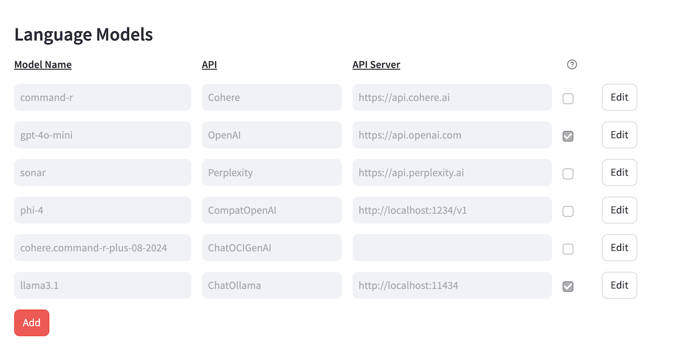

  * The default LLMs for embeddings are:

  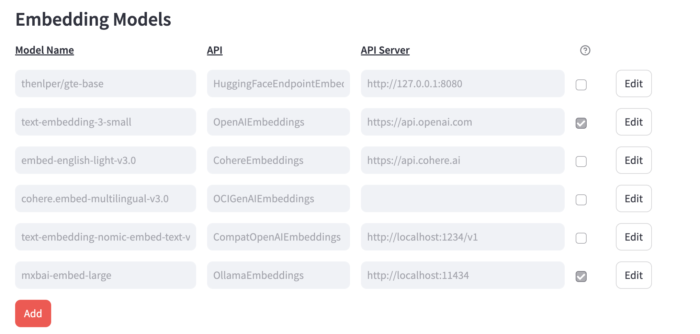

  * **OPTIONAL**: We can configure the Ollama models so that they can reach a url endpoint where the models are already configured. For example, click on the *edit* button for llama3.1 LLM and fill the *API URL* field with this endpoint 

 ```plaintext
  http://<IP_OLLAMA>:11434 
  ```

  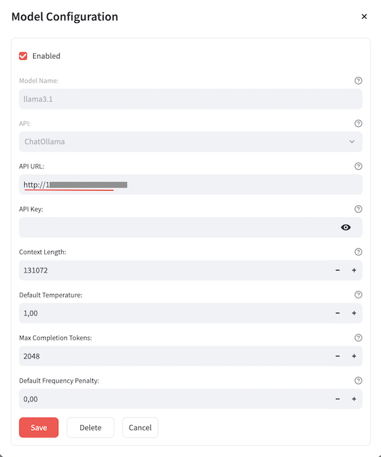

  Now repeat this step also for the *mxbai-embed-large* embedding model.

* **OPTIONAL**: Let's add another LLM to Ollama (for local deployments only) and enable it in the model list.

  * Let's add the model LLama3.2:

  ```bash
    ollama run llama3.2
  ```
  * Now, we will enable in the model list. Under left menu **Models** / **Language Models**, press button **Add**, and complete the form with the values shown in the following snapshot:

  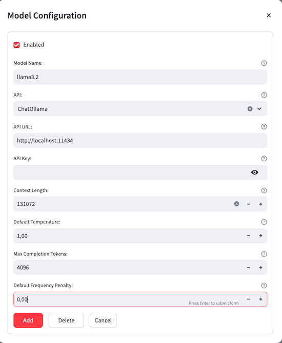


### 2.4 Chat
The two LLMs availble could be tested straightful to understand their behaviour with generic questions. Before to access the chat GUI


scroll down the left side menu to find the **Chat model** menu:


and, with the **Enable RAG?** check-box not selected, choose the **gpt-4o-mini** and ask generic question like:
```
Which kind of database you can use to run the Java Web example application?
Can I use any kind of development environment to run the example?
```
NOTICE: *if you see a message on top **Database has no Vector Stores. Disabling RAG.** don't care since you haven't yet create a vector store and you can't use the RAG*.

As you can see, even if the question mean to refer a specific example, the LLM answer in a generic way. 

* Click the button **Clear** under **History and Context**, and choose the other LLM available, **llama3.1**,
to start a conversation with the same questions, and compare the answers. Note that the History is enabled by default. The **Clear** button reset the “context window” and start a fresh interaction with a model.

* Play with the **Temperature** parameter, and the others to compare the quality of the answers, for each LLM available. Clear the history pressing button **Clear** after each cycle.


### 2.5 Prepare vector store
Proceed as shown [here](SPLIT-EMBED.md) to prepare a vectorstore to augment the answers provided by the chatbot compare with a plain LLM that hasn't enough context info to answer on a topic.

### 2.6 RAG test
Now that we have two vector store, let's start to test the second knowledge base created with the OpenAI service:`TEST2` to use classical public resources.

* Clear history pressing button **Clear** and choose **gpt-4o-mini** model for initial test.

* Scrolling down the left side pane, **Enable RAG?**. 

* In **Select Alias** dropdown box, select the `TEST2` vector store table. You will see the rest of the fields of **Vector Store** menu automatically populated, since each of them represent a search parameter that could be used to select the vector store created. In this case, the alias is enough to determine what you are looking for but, from the other side, you have the evidence of the parameteres used to create the chunk and related embeddings vector.

* Let's ask again the same questions to which the LLM has provided generic anwers since not related to the document loaded that the LLM ignored in its training or not enough addressed in the questions:

```
Which kind of database you can use to run the Java Web example application?
Which Java environment should be used to run this example?
```

On TEST2 vector store you will try with the main params set in the following way, how will change the quality of the answers. 
**IMPORTANT**: Clear history, pressing button **Clear** after each question, also if you change the parameters and repeat the same question.

  * LLM:gpt-4o-mini
  * TopK: 4
  * Search Type: Similarity
  * Temperature: 0

```
Q: Which Java environment should be used to run this example?

A: The example should be run in an integrated development environment (IDE), specifically using IntelliJ IDEA community version as recommended in the documentation. Additionally, it will require a Web server with a servlet and JSP container, with Apache Tomcat being the server suggested for deploying the JSP pages (as per the guide).
```

  * LLM: gpt-4o-mini
  * TopK: 10
  * Search Type: Similarity
  * Temperature: 0

```
Q: Which Java environment should be used to run this example?

A: The example is recommended to be developed in an integrated development environment (IDE) like IntelliJ IDEA, specifically the community version, for ease of development. Additionally, the application uses Apache Tomcat as the web server for deploying the JavaServer Pages (JSP) technology in the HR Web application. For database connectivity, the Java code should be run on the Oracle Database, leveraging the capabilities of the Oracle JDBC Thin driver with a Java Virtual Machine (JVM) (Chapter 4 and Chapter 1).
```

**COMMENT**: as you can see with more chunks provided, the bot mentions also other technologies like Oracle JDBC, JVM and the Oracle Database.


  * LLM: gpt-4o-mini
  * TopK: 4
  * Search Type: Similarity
  * Temperature: 0
```
Q: Which kind of database you can use to run the Java Web example application?

A: You can use the Oracle Database, specifically the Autonomous Transaction Processing database, to run the Java Web example application. This is part of the requirements for developing the HR web application, which operates within the Oracle Database environment (see Chapter 4, "What You Need to Install").
```

  * LLM: gpt-4o-mini
  * TopK: 10
  * Search Type: Similarity
  * Temperature: 0

```
Q: Which kind of database you can use to run the Java Web example application?

A: You can use the Oracle Database to run the Java Web example application, specifically the HR schema within the Oracle Database. The application can be developed using either an on-premises installation of Oracle Database or Oracle Autonomous Database in the cloud (as part of Oracle Cloud Free Tier) which is recommended for its ease of access and automation (see Chapter 4).
```

**COMMENT**: In the second answer it mentions the Oracle Cloud Free Tier.

* Conclusion: we can suppose that 10 chunks as TopK similar vector represents a better parameters than the deafult 4.

* Play with Temperature to discover how much become reacher in terms of expressions the answers provided.

* Follow a question by another like "more" to have the evidence that the history is considered providing the answer in the conversation.

* Clear history, pressing button **Clear**

### 2.6.1 OLLAMA test.
Repeat the tests with local LLMs based on the OLLAMA server and vector store: `TEST1`, and choose **llama3.1** in **Chat model** dropdown menu to have the same LLM provider.
 

### 2.7 Testbed
We are confident that changing some parameters the quality and accuracy of the answers improve. But are you sure that on a large scale deployment your setup it's reliable on hundreds or thousands of different questions?
Testbed helps you to massive test your chatbot, generating for you a Q&A test dataset and automatically try on your current configuration. Let's access to the Testbed from left pane menu:

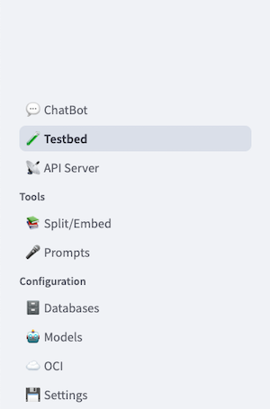

#### Generate a Q&A Test dataset
The platform allows to generate as many questions and answer you desire, based on a single document, that it's part of the knowledge base you have store as vector store with their own embeddings. Selecting the proper radio button you will access to the AI Explorer test dataset generation capabilities:


* Upload the document used to create the vector store, getting from this [this link](https://docs.oracle.com/en/database/oracle/oracle-database/23/tdpjd/get-started-java-development.pdf).

* Increase the number to be generated to 10 or more. Take in consideration that the process it's quite long, especially if you will use local LLM for Q&A generation without enough hardware capacity. In case of OpenAI remote model, the process it's less affected by increasing the number of Q&As than the private LLM approach.

* Leave the default option for:
  * Q&A Language Model: **gpt-4o-mini**
  * Q&A Embedding Model: **text-embedding-3-small**

* Click on **Generate Q&A** button and wait up to the process is over:

  

* Browse the questions and answers generated:

  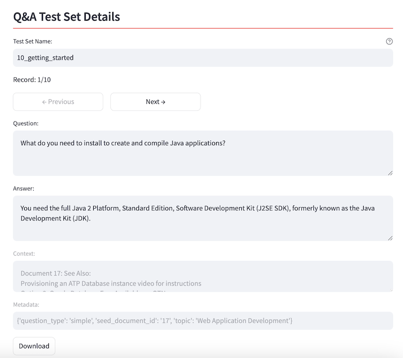

  Note that the **Question** and the **Answer** fields are editable, since you can correct at your convenience the proposed Q&A pairs based on the **Context** that has been extracted randomly and not editable, as well as the **Metadata** that are set by the Testbed engine. In Metadata field you'll find a **topic** tag that classify the Q&A. The topic list is generated automatically analyzing the text and added to each Q&A. It will used in the final report to drilldown the **Overall Correctness Score** and identify area in which the chatbot lacks of precision.
  The **Download** allow to export and modify in each part the Q&A dataset generated. Open it in Visual Studio Code to see the content:

  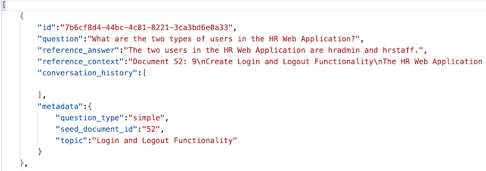

* Update the **Test Set Name**, changing the default one automatically generated, in order to identify more easily later the test dataset for repeated tests on different chatbot configurations. For example, from:

  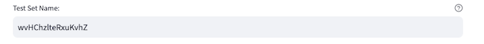

change in :

  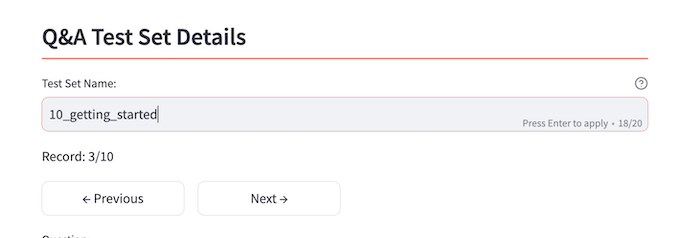

* On the left pane menu:

  * Under **Language Model Parameters**, select in the **Chat model** dropdown list **gpt-4o-mini**
  * **Enable RAG?** if for any reason hasn't been selected
  * Choose in the **Select Alias** dropdown list the **TEST2** value.
  * Leave unchanged the default parameters on the left pane.

* Leaving the default one model to judge, **gpt-4o-mini**, click on **Start Evaluation** button and wait a few seconds. All the questions will be submitted to the chatbot as configured in the left pane:

  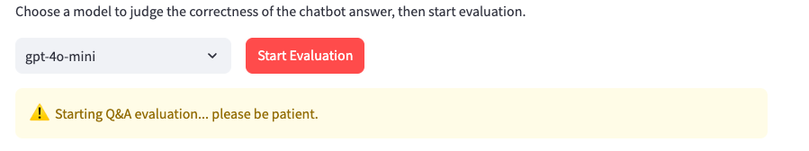

* Let's examine the result report, starting from the first part:

  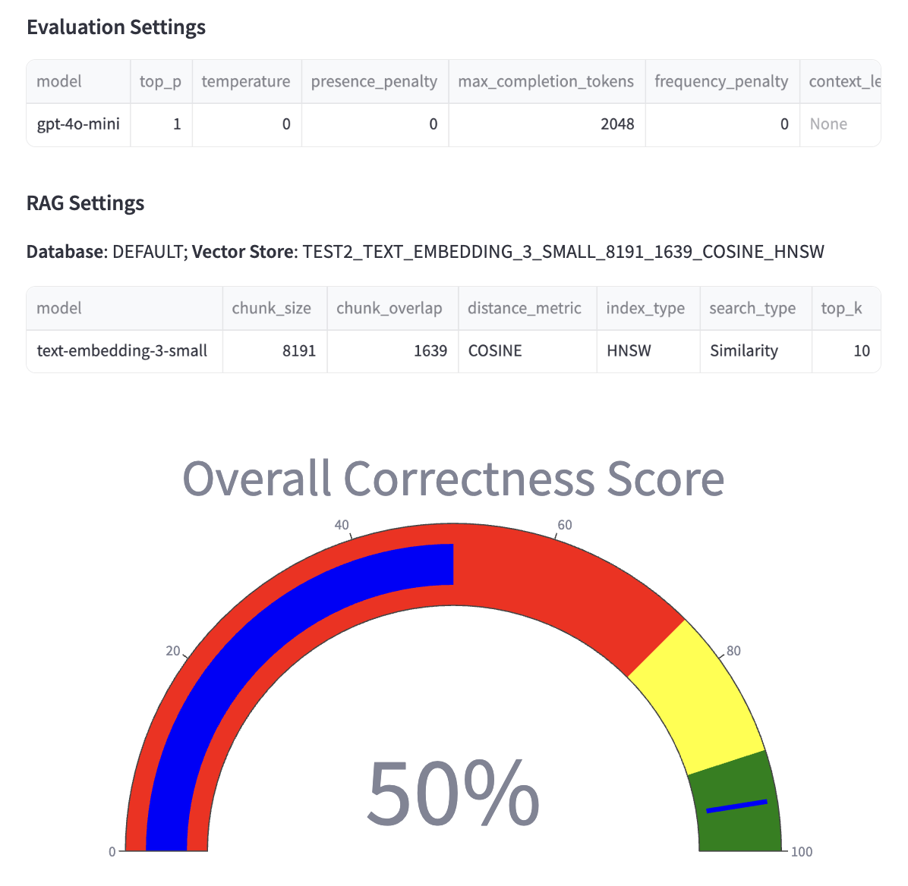

It shows:
  * The chatbot's **Evaluation Settings** as it has been configured in the left side playground, before start the massive test
  * The **RAG Settings** for the Database and the relative Vector Store selected, with the name of the embedding **model** used and all the parameters set, from **chunk_size**, to the **top_k**.
  * The **Overall Correctness Score** that represents the percentage between the total number of questions submitted and the answers considered correct by the LLM used to judge the response compared the reference answer.
  * The **Correctness By Topic**: each question in the test dataset comes with a tag that represents the topic it belongs to. The list of topics it's extracted automatically at the creation step of the Q&A synthetic dataset. 

The second part of the report provides details about each single questions submitted, with a focus on the collection by **Failures** and the **Full Report** list. To show all the fields, scrool from the right to left to see all info. In the following picture the second frame has been scrolled:

  

  * **question**: question submitted
  * **reference_asnwer**: represents the anwers that is considered correct an we aspect quite similar to the answer will be provided by the agent
  * **reference_context**: the section of document extracted and used to create the Q&A
  * **agent_answer**: the answer provided by the chatbot with the current configuration and knowledge base as vectorstore
  * **correctness_reason**: it reports eventually why has been judged not correct. If the answer 
  has been considered right you'll see **None** as value.

* You can get a copy of the results as an HTML page reporting the *Overall Correctness Score* and *Correctness By Topic* only, cliccking on the **Download Report** button. Click it to view how is the report. 

* You can also dowload the **Full Report** and **Failures** list as a *.csv* file selecting each frame as shown in the following snapshot:

  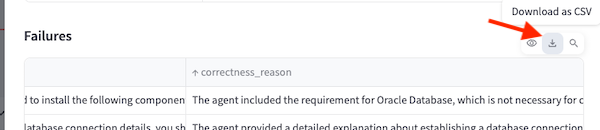

* Now let's test through an external saved test datset, that you can download [here](https://raw.githubusercontent.com/oracle-samples/ai-explorer/refs/heads/cdb/docs/hol/artifacts/getting_started-30_testset.json) with 30 questions already generated. If you want to drop some Q&A that are not meaningful in your opinion, update it, save and reload as local file, following the steps shown in this snapshot:

  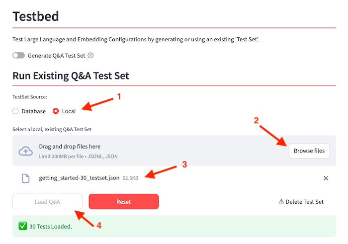

* Now redo the test to get the **Overall Correctness Score** with much more Q&A pairs.

* Let's change the Chat model parameters, setting to **0** the Model **Temperature** in the left pane, section **Language Model Parameters**. Why? The Q&As generated are usually done with a low level of creativity to be less random in the content and express the core concepts avoiding "frills". So, repeat the test to check if there are any improvements in the **Overall Correctness Score**. 

* To compare with previous results, click on dropdown list unde **Previous Evaluations for...** and click on **View** button to show the overall report.

  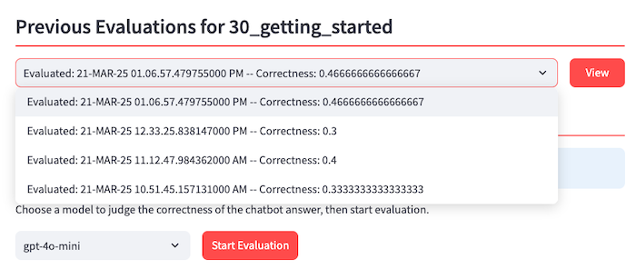

* Repeat the tests as many time you desire changing: **Vector Store**, **Search Type** and **Top K** to execute the same kind of tuning you have done at the previous steps with just a few interactive questions, now on a massive test on curated and comparable assets.

## 3. Export and run the chatbot as a Spring AI microservice

The AI Explorer allows to export the chatbot defined as a ready-to-run microservice built in Java, Spring Boot and Spring AI framework, that will run independently by the AI Explorer, leveraging only the vector store table created, and the LLM servers used. In the current relase are supported only fully Ollama configuration (embeddings + chat model) or OpenAI.

### 3.1 Pre-requisites
To run the microservice exported you need:
  * JDK 21.x 
  * Apache Maven 3.8.x
  * curl command

### 3.2 Execute the Ollama version

* **Select Alias:** as **TEST1** vector store, and **LLama3.1** as **Chat model**. In this way the configuration will be based on the Ollama LLM server provider for both LLMs, embeddings and chat, and go to the **Settings** menu in the left pane side. You'll find the **Download SpringAI** button available. This

If you'll find a message like this:

  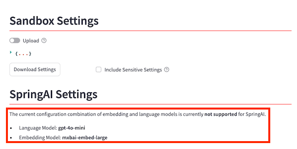

don't worry: choose for the **Chat model:** the **llama3.1** and the button will appear.

* Download one of them through the `Download SpringAI` button. 

* Unzip the file in a subdir.

* Open a terminal and set the executable permission on the `env.sh` with `chmod 755 ./start.sh`.

* Start the microservice a with:

```
./start.sh
```

* This microservice expose a web service that will accept HTTP GET requests at:

  * `http://localhost:8080/v1/chat/completions`: to use RAG via OpenAI REST API;
  * `http://localhost:8080/v1/service/llm` : to chat straight with the LLM used;
  * `http://localhost:8080/v1/service/search/`: to search for document similar to the message provided.

* To test it, run a curl command like this in a new terminal:

  ```
  curl -X POST "localhost:8080/v1/chat/completions" \
     -H "Content-Type: application/json" \
     -H "Authorization: Bearer your_api_key" \
     -d '{"message": "Can I use any kind of development environment to run the example?"}'  
  ```

  The response with RAG, on the **TEST1** Vector store, it will be like this:

  ``` 
  {
    "choices": [
      {
        "message": {
          "content": "Yes, you can use any kind of development environment to run the example, but for ease of development, the guide specifically mentions using an integrated development environment (IDE). It uses IntelliJ IDEA Community version as an example for creating and updating the files for the application (see Document 96EECD7484D3B56C). However, you are not limited to this IDE and can choose any development environment that suits your needs."
        }
      }
    ]
  }
  ```

  A request without leverage RAG:
  ```
  curl --get --data-urlencode 'message=Can I use any kind of development environment to run the example?' localhost:8080/v1/service/llm 
  ```

     it will produce a response not grounded like this:

  ```
  {
    "completion": "Yes, you can use various development environments to run examples, depending on the programming language and the specific example you are working with. Here are some common options:\n\n1. **Integrated Development Environments (IDEs)**:\n   - **Visual Studio Code**: A versatile code editor that supports many languages through extensions.\n   - **PyCharm**: Great for Python development.\n   - **Eclipse**: Commonly used for Java development.\n   - **IntelliJ IDEA**: Another popular choice for Java and other languages.\n   - **Xcode**: For macOS and iOS development (Swift, Objective-C).\n\n2. **Text Editors**:\n   - **Sublime Text**: A lightweight text editor with support for many languages.\n   - **Atom**: A hackable text editor for the 21st century.\n   - **Notepad++**: A free source code editor for Windows.\n\n3. **Command Line Interfaces**:\n   - You can run"
  }
  ```

### 3.3 Execute the OpenAI version
Proceed as in the previous step, choosing in **Select Alias:** the **TEST2** vector store, and **gpt-4o-mini** as **Chat model**. In the terminal where you'll run the Spring Boot microservice, be sure that the **OPENAI_API_KEY** is correctly set.


## 4. Backup Env
All the AI Explorer server can be exported to save the configuration as backup and imported in another server.

* Go to the left pane menu **Settings**:

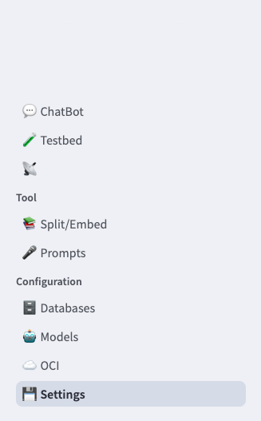

* Drilling down the tree, you can access to all the parameters related, for example, to one of the LLMs configured:

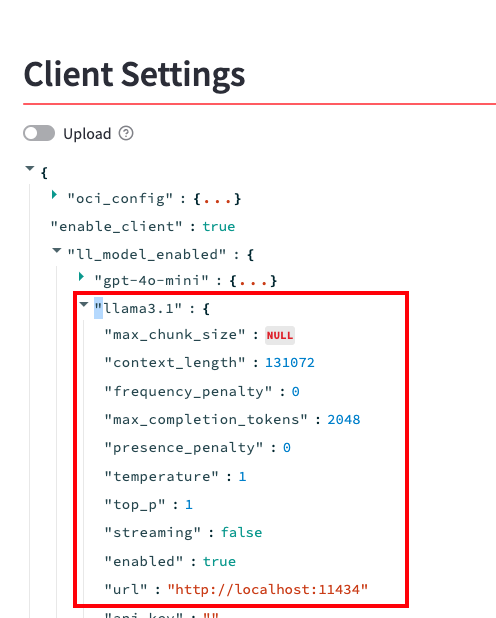

* From this page you can:
  * **Upload** and existing configuration file
  * **Download Settings** of the current configuration
  * Exclude by the download the credential parameters, unchecking the **Include Sensitive Settings**


## 5. Challenge
Using the following doc: [Oracle Government PaaS and IaaS Cloud Services - Service Descriptions](https://www.oracle.com/contracts/docs/us_gov_tech_cloud_3902270.pdf) and the Test Dataset created [here](https://raw.githubusercontent.com/oracle-samples/ai-explorer/refs/heads/cdb/docs/hol/artifacts/OCIGOV50_testset.json) get the best **Overall Correctness Score**. 
