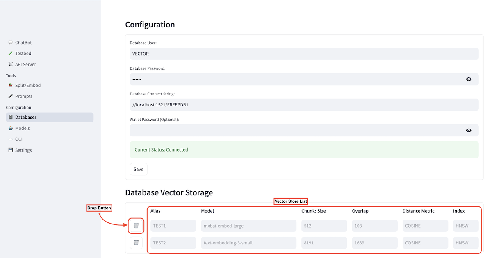

# Split/Embed Documents

<!-- spell-checker:ignore streamlit, venv, oaim -->

In the **Split/Embed** tab, the AI Explorer allows you to upload various types of documents and transform their content into vector embeddings in a format that is interpretable by LLMs.


You can choose from the embedding models you selected during the initial configuration using a drop-down menu and adjust their parameters accordingly.
For the first one choose **mxbai-embed-large**. The chunk size defines the length of each segment into which the document will be split, while the chunk overlap represents the percentage of overlap between consecutive chunks relative to the chunk size.

Additionally, you can select different distance metrics and index types to experiment with various vector representations of the same document, allowing you to identify the configuration that best meets your needs.

Once configured, scroll down to the Load and Split Documents section to upload the document you wish to store in your **Oracle Database 23ai**.


You can choose from three different file sources:

* **OCI**: Navigate through your tenancy to select documents from the Object Storage. Ensure that your OCI credentials are properly configured in advance.
* **Local**: Upload a document directly from your local environment.
* **Web**: Import a document from a publicly accessible web URL.

In this example, we will embed a document from the web, available at [this link](https://docs.oracle.com/en/database/oracle/oracle-database/23/tdpjd/get-started-java-development.pdf). We will give the alias ***TEST1*** to this vector store.

You can then click on the **Populate Vector Store** button and start the embedding process.

Once the process is complete, a green confirmation prompt will appear, indicating the number of chunks that have been generated and successfully stored in the database.


This means that 224 vectors representations of the information from the input document have been created and stored.

As an example, you can query the vector store by connecting to your Oracle Database 23ai using the SQL Developer plugin we mentioned earlier:


Then, you can retrieve the rows from the newly created table with this command:

```sql 
select * from VECTOR.TEST1_MXBAI_EMBED_LARGE_512_103_COSINE_HNSW;
```

What you see in the image above are chunks of text from the input document, which have been transformed into vector format and stored in the Oracle database. Essentially, you’ve replicated the knowledge contained in the document within your database!

By following the sames steps, we can creat another vector store using the same document but with a different embedding model, **text-embedding-3-small** from the OpenAI models. We will give the alias ***TEST2*** to this vector store. 
In this case, we will get a smaller number of chunks, since the model supports a chunk size of 8191 instead of the 512 given by *mxbai-embed-large*:


You can now navigate to the Database tab in the AI Explorer to see the list of all the vector stores that have been created. If needed, you can easily delete them with a single click.


