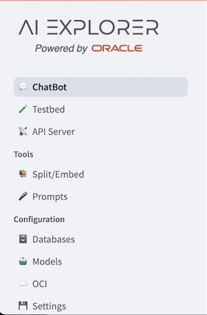
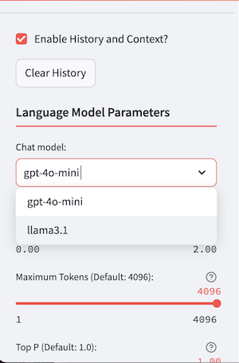

# Hands-on-lab Guide

## Set up
In this first step we are going to set up all the required components to run the AI Explorer for Apps.

### Containers runtime engine
We begin by starting our container runtime engine. We will be using Colima here,
and assuming that you are using an Apple Silicon Mac.
Start the container runtime engine.  If you already have a profile that you use, please double-check that it uses 4
CPUs and 8GB of memory.
```bash
colima start --vm-type vz --vz-rosetta --mount-type virtiofs --cpu 4 --memory 8
```

### Install and start Oracle DB 23ai

We are going to use Oracle Database 23ai to take advantage of the vector search feature among other things, so we spin up a container with it. Proceed as describd here: [DB](INSTALL_DB23AI.md)


### LLM runtime
We would like to interact with different LLMs locally and we are going to use Ollama for running them. We are going to use it in if Ollama isn't installed in your system already, you can use brew:

```bash
  brew install ollama
```

You can run Ollama as a service with:
```bash
  brew services start ollama
```

Or, if you don't want/need a background service you can just run:
```bash
  /opt/homebrew/opt/ollama/bin/ollama serve
```

We are going to interact with some LLM models, so we need to install them in Ollama (llama3.1 and mxbai for the embeddings):

```bash
ollama pull llama3.1
ollama pull mxbai-embed-large
```

For OpenAI you need the OPENAI_API_KEY to authenticate and use their services. 

### Clone the right branch
* Make sure to clone the branch `hol`. In a `<project_dir>` proceed in this way:
```bash
git clone --branch hol --single-branch https://github.com/oracle-samples/oaim-sandbox.git
```

### Install requirements:
  ```bash
    python3.11 -m venv .venv
    source .venv/bin/activate
    pip3 install --upgrade pip wheel
    pip3 install -r src/requirements.txt
  ```

### Startup 
The two scripts `server.sh` and `sandbox.sh` hold env variables needed to connect the DB and OpenAI. Set the `OPENAI_API_KEY` in the server script. If, for any reasons, you need to adapt the DBMS to a different instance and setup, change the variables accordingly.

* In a separate shell:

    ```bash
    <project_dir>source ./server.sh
    ```

and get api-key from logs:


* set in `sandbox.sh` the server API key:
  ```bash
  export API_SERVER_KEY=<generated_key>
  ```

* in another terminal:
  ```bash
  <project_dir>source ./sandbox.sh
  ```

## Explore the env
In a browser, open the link: `http://localhost:8502/`

### DB connection

Let's check if the DB is correctly connected:


* You should see the message: `Current Status: Connected`

### LLM config:

Let's check models available:


  * LLMs for chat completions must be:

  

  * LLMs for embeddings must be:

  

### Chat
The two LLMs availble could be tested straightful to understand their behaviour with generic questions. Before to access the chat GUI



scroll down the left side menu to find the **Chat model** menu:



and, with the **Enable RAG?** check-box not selected, choose the **gpt-4o-mini** and ask generic question like:
```
Which kind of database you can use to run the Java Web example application?
Can I use any kind of development environment to run the example?
To run the example, how can I check if the dbms it is working correctly?
```
As you can see, even if the question mean to refer a specific example, the LLM answer in a generic way. 

* Clear the History, by default checked, and choose the other LLM available, **llama3.1**,
to start a conversation with the same questions, and compare the answers.

* Play with the **Temperature** parameter, and the others to compare the quality of the answers, for each LLM available. Clear the history after each cycle.


### Prepare vector store
Proceed as shown [here](SPLIT-EMBED.md) to prepare a vectorstore to augment the answers provided by the chatbot compare with a plain LLM that hasn't enough context info to answer on a topic.

### RAG test
Now that we have two vector store, let's start to test the first knowledge base created with the local LLMs based on the OLLAMA server:`TEST1`

* Clear history and choose llama3.1 model for initial test.

* Scrolling down the left side pane, **Enable RAG?**. 

* In **Select Alias** dropdown box, select the `TEST1` vector store table. You will see the rest of the fields of **Vector Store** menu automatically populated, since each of them represent a search parameter that could be used to select the vector store created. In this case, the alias is enough to determine what you are looking for but, from the other side, you have the evidence of the parameteres used to create the chunk and related embeddings vector.

* Let's ask again the same questions to which the LLM has provided generic anwers since not related to the document loaded that the LLM ignored in its training or not enough addressed in the questions:

```
Which kind of database you can use to run the Java Web example application?
Which Java environment should be used to run this example?
```

TEST1

```
 gpt-mini - 4 - similarity - temp 0
Which Java environment should be used to run this example?


The example should be run in a Java environment that includes a servlet and JSP container, specifically using Apache Tomcat as the web server for deploying the JSP pages. Additionally, it requires the appropriate JDBC drivers, which can be downloaded from Maven Central. Make sure to set the PATH environment variable for the JDK as well.


gpt-mini - 10 - similarity - temp 0

The example suggests using the Apache Tomcat server as the web server with a servlet and JSP container for deploying the Java web application. Additionally, it recommends using IntelliJ IDEA as the integrated development environment (IDE) for developing the application. You will also need to set the PATH environment variable for the JDK and download necessary JDBC drivers from Maven Central for the application.


```