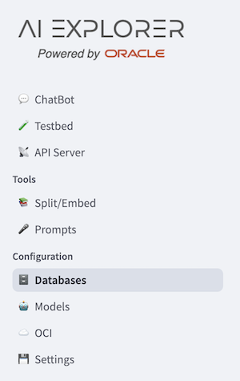
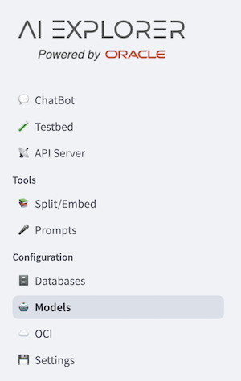
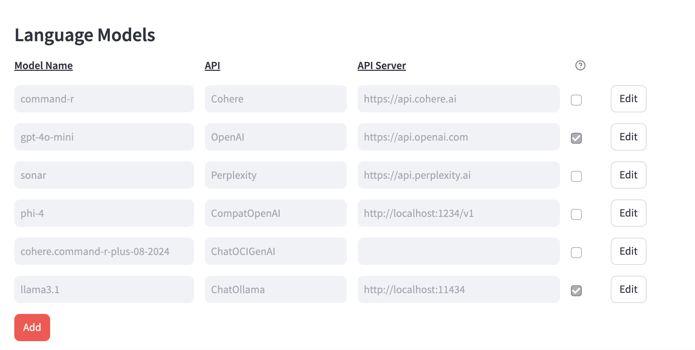
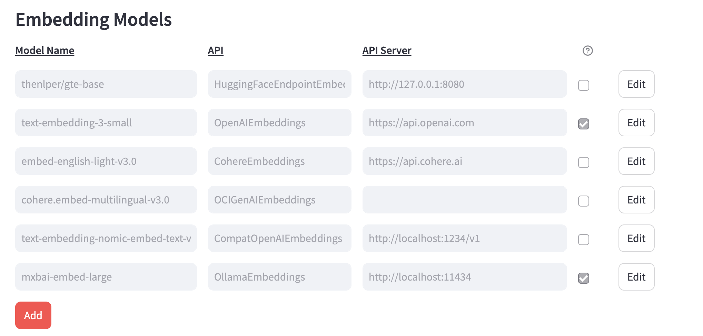

# Hands-on-lab Guide

* install DB:

  ```bash
  podman run -d --name db23ai -p 1521:1521 container-registry.oracle.com/database/free:latest
  ```

* start DB: 
  ```bash
  colima start x64
  ```

* install ollama

* start ollama

* install llama3.1:
```bash
podman exec -it ollama ollama pull llama3.1
```

* install embeddings:
```bash
podman exec -it ollama ollama pull mxbai-embed-large
```
* clone repository:
```bash
git clone --branch hol --single-branch https://github.com/oracle-samples/oaim-sandbox.git
```
* Install requirements:
  ```bash
    python3.11 -m venv .venv
    source .venv/bin/activate
    pip3 install --upgrade pip wheel
    pip3 install -r src/requirements.txt
  ```

* Update `server.sh`, `sandbox.sh` if needed.

* In a separate shell:

    ```bash
    <project_dir>source ./server.sh
    ```

* get api-key from logs:


* set in `sandbox.sh` the 
  ```bash
  export API_SERVER_KEY=<generated_key>
  ```
* in another terminal:
  ```bash
  <project_dir>source ./sandbox.sh
  ```

* open a browser on link `http://localhost:8502/`

* let's check if the DB is correctly connected:



* You should see the message: `Current Status: Connected`

* let's check models:



  * LLMs for chat completions must be:

  

  * LLMs for embeddings must be:

  
